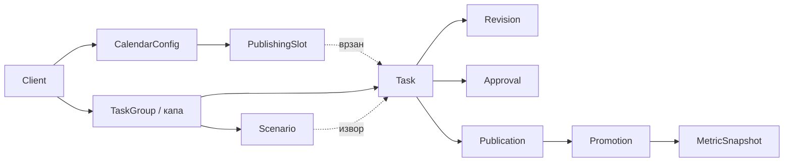
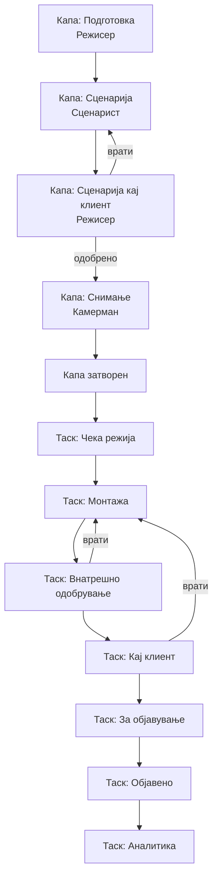
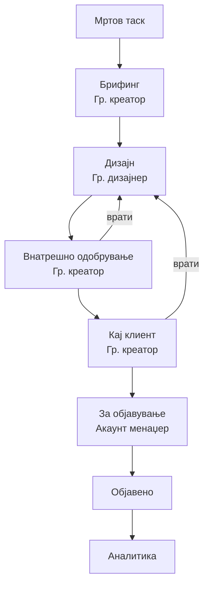

# PRD — GoDigital Task Manager v2.0

2026-09-20 · Product Owner: @Someone · Статус: за development

## 1. Цел, контекст и опсег

Системот го води производството на графичка и видео содржина за 30+ месечни клиенти, од резервација на датумот за објава до објавување и мерење резултати.

Денес работата се води рачно — по Viber групи, табели и меморија. Нема единствено место каде што се гледа кој клиент до кога има покриен контент, во кој статус е секоја објава, кој вработен што работи и зошто нешто доцни.

### Цели и мерка на успех

| #   | Цел                                             | Мерка                                                   |
| --- | ----------------------------------------------- | ------------------------------------------------------- |
| 1   | Секоја објава има сопственик, статус и датум    | 100% активни таскови со доделен вработен                |
| 2   | Датумите се резервирани однапред за цел договор | Покриеност 30+ дена нанапред по клиент                  |
| 3   | Доцнењата се видливи пред да станат проблем     | Аларм пред датумот, не по него                          |
| 4   | Целосна историја на одобрувања и измени         | Секоја верзија, коментар и промена на датум е логирана  |
| 5   | Подготвена основа за AI модули                  | Сите настани и содржини структурирани за векторска база |

### Во опсег на Фаза 1

Клиенти и конфигурација · улоги и дозволи · календар со автоматско резервирање датуми · капа таскови и мртви таскови · видео и графички работен тек · внатрешно одобрување · внесување одговор од клиент · копи и рачно објавување · автоматско влечење метрики од Meta · Rule Builder · доделување модули по клиент · аларми · прозорци List, Board, Календар, Task Detail и Мои задачи.

### Надвор од опсег

PWA за клиент · AI модули (GoScripterAI, GraficarAI, AI копирајтер, Claude агент) · продажен CRM · Timeline/Gantt, Workload, Portfolios · автоматско објавување преку API.

### Принципи на дизајн

1. Системот резервира датуми, луѓето создаваат содржина — датумот постои пред содржината.
2. Ништо не се брише. Промена на датум, доработка или откажување станува запис во историјата.
3. Никој не го поминува чекорот на друг. Статусот го менува само улогата што го поседува.
4. Конфигурација наместо код. Автоматизации, календари и модули се менуваат од интерфејс.

## 2. Улоги и дозволи

Секој вработен има **точно една улога во системот**. Единствен исклучок: еден човек може да ги носи и двете улоги Режисер и Сценарист. Кога тоа е обележано на неговиот профил, во интерфејсот му се појавуваат и двата сета задачи.

Улогата е глобална, не по клиент. Ист човек не може да биде дизајнер кај еден клиент и креатор кај друг.

### Улоги

| Улога             | Што работи во системот                                                                                                                                                                                                 |
| ----------------- | ---------------------------------------------------------------------------------------------------------------------------------------------------------------------------------------------------------------------- |
| Графички креатор  | Пишува брифинг и прикачува референци; внатрешно одобрува графика; внесува одговор од клиент за графика                                                                                                                 |
| Графички дизајнер | Изработува и прикачува графика; работи измени по коментар                                                                                                                                                              |
| Режисер           | Отвора капа таск: избира сценарист, датум, час и место на снимање; внесува одговор на клиент за сценарија; потврдува суров материјал и доделува монтажер; внатрешно одобрува видео; внесува одговор од клиент за видео |
| Сценарист         | Пишува документ со сценарија и го прикачува во капа таскот                                                                                                                                                             |
| Камерман          | Прикачува суров материјал од снимањето                                                                                                                                                                                 |
| Монтажер          | Монтира и прикачува готово видео; работи измени по коментар                                                                                                                                                            |
| Акаунт менаџер    | Пишува копи, објавува рачно, потврдува објава со линк; ја потврдува месечната предлог-распоредба на датуми                                                                                                             |
| Аналитичар        | Одлучува органски или платено; води кампања и ги следи метриките                                                                                                                                                       |
| Директор          | Ги гледа сите клиенти и статуси, ги доделува модулите, ги менува автоматизациите, ги внесува вработените и клиентите                                                                                                   |

### Правила за self-approval

Внатрешното одобрување го прави улога различна од онаа што ја создала содржината. Системот **го блокира** доделувањето каде што Режисерот на таскот е истовремено и негов Монтажер. Истото важи за Графички креатор и Графички дизајнер.

Комбинацијата Режисер + Сценарист е дозволена зашто тој не си го одобрува сопствениот производ — сценаријата ги одобрува клиентот, а монтажата ја прави друг.

### Матрица на дозволи

Ч = чита · П = пишува/менува · — = нема пристап

| Објект                      | Директор | Акаунт мен. | Режисер   | Сценарист | Камерман  | Монтажер  | Гр. креатор | Гр. дизајнер | Аналитичар |
| --------------------------- | -------- | ----------- | --------- | --------- | --------- | --------- | ----------- | ------------ | ---------- |
| Клиенти (создавање/измена)  | П        | Ч           | Ч         | —         | —         | —         | Ч           | —            | Ч          |
| Календар и слотови          | П        | П           | Ч         | —         | —         | —         | Ч           | —            | —          |
| Капа таск видео             | Ч        | Ч           | П         | Ч         | Ч         | Ч         | —           | —            | —          |
| Капа таск графика           | Ч        | Ч           | —         | —         | —         | —         | П           | Ч            | —          |
| Таск: брифинг               | Ч        | Ч           | П (видео) | Ч         | Ч         | Ч         | П (графика) | Ч            | Ч          |
| Таск: креатива              | Ч        | Ч           | Ч         | —         | П (суров) | П (видео) | Ч           | П (графика)  | Ч          |
| Таск: копи                  | Ч        | П           | Ч         | —         | —         | —         | Ч           | —            | Ч          |
| Таск: промена на датум      | П        | П           | П         | —         | —         | —         | П           | —            | —          |
| Внатрешно одобрување        | Ч        | —           | П (видео) | —         | —         | —         | П (графика) | —            | —          |
| Внесување одговор од клиент | Ч        | Ч           | П (видео) | —         | —         | —         | П (графика) | —            | —          |
| Објавување и линк           | Ч        | П           | Ч         | —         | —         | —         | Ч           | —            | Ч          |
| Реклами и метрики           | Ч        | Ч           | —         | —         | —         | —         | —           | —            | П          |
| Автоматизации               | П        | Ч           | —         | —         | —         | —         | —           | —            | —          |
| Доделување модули           | П        | —           | —         | —         | —         | —         | —           | —            | —          |
| Вработени и улоги           | П        | —           | —         | —         | —         | —         | —           | —            | —          |
| Извештаи по клиент          | П        | Ч           | Ч         | —         | —         | —         | Ч           | —            | Ч          |

Секој вработен во „Мои задачи“ ги гледа само тасковите каде што е доделен и каде што статусот му припаѓа на неговата улога. Целиот преглед по клиент е достапен на Директор и Акаунт менаџер.

## 3. Податочен модел

Клучната одлука: **терминот и содржината се одвоени**. `PublishingSlot` е резервираниот датум, `Task` е содржината. Затоа таск може да се премести на друг датум без да се изгуби историјата, а датум може да остане празен и видливо да поцрвени.

### Client

| Поле                                  | Тип       | Забелешка                                           |
| ------------------------------------- | --------- | --------------------------------------------------- |
| id, name, logo                        | —         | основни                                             |
| status                                | enum      | активен / пауза / завршен                           |
| contractStart, contractMonths         | date, int | до кога се генерираат слотови                       |
| videosPerMonth, graphicsPerMonth      | int       | 0 значи дека секторот не се користи                 |
| usesMetaAds                           | bool      | одредува дали таскот воопшто стигнува до Аналитичар |
| metaAdAccountId, metaPageId, metaIgId | string    | за влечење метрики                                  |
| calendarType                          | enum      | стандарден / специфичен                             |
| approvalChannel                       | enum      | viber / whatsapp / email                            |
| clientContacts                        | текст     | кој одобрува, телефон, mail                         |
| defaultAssignees                      | мапа      | улога → вработен, за автоматско доделување          |
| activeModules                         | листа     | модули доделени од Директор                         |
| notes                                 | текст     | траен контекст за клиентот (влегува во AI базата)   |

### Employee

`id · име · улога (една) · isScenaristToo (само за Режисер) · активен · email · телефон · капацитет (информативно)`

### CalendarConfig и PublishingSlot

`CalendarConfig`: по клиент и по тип содржина — дозволени денови во неделата, исклучени датуми (празници), време на објава, дали се дозволени две објави во ист ден.

`PublishingSlot`: `клиент · тип (видео/графика) · датум · редослед во денот · статус (слободен / резервиран / искористен / пропуштен) · таск (ако е врзан)`

### TaskGroup (капа таск)

| Поле                                | Забелешка                                                                                                 |
| ----------------------------------- | --------------------------------------------------------------------------------------------------------- |
| клиент, тип, месец                  | еден капа по клиент, по тип, по месец                                                                     |
| статус                              | видео: Подготовка → Сценарија → Сценарија кај клиент → Снимање → Затворен. Графика: Подготовка → Затворен |
| сценарист, режисер                  | доделени при отворање                                                                                     |
| shootDate, shootTime, shootLocation | само видео, задолжителни пред испраќање кај сценарист                                                     |
| планиран број таскови               | од договорот на клиентот                                                                                  |
| заеднички фајлови                   | документ од клиент, лого на партнер, заеднички слики — ги наследуваат сите деца                           |
| затворен во                         | timestamp на автоматското затворање                                                                       |

### Task

| Поле                   | Забелешка                              |
| ---------------------- | -------------------------------------- |
| капа таск, клиент, тип | —                                      |
| статус                 | види Секција 7                         |
| isDead                 | мртов = резервира датум, нема содржина |
| слот                   | врска до PublishingSlot                |
| сценарио               | само видео, врска до Scenario          |
| брифинг                | текст + референци (графика)            |
| доделен вработен       | по статус                              |
| креатива               | финален фајл, со верзии                |
| копи                   | текст од Акаунт менаџер                |
| приоритет              | нормален / итен                        |
| dateChangeLog          | секоја промена на датум со причина     |

### Scenario

`капа таск · реден број · наслов · хук · текст · забелешки · статус (предложено / одобрено / отфрлено) · верзија · извор (рачно / AI)`

Документот на сценаристот се чува како фајл и паралелно се дели на записи. Поделбата е по маркер (`СЦЕНАРИО N:`), со можност за рачна корекција пред активација.

### Revision

`таск · верзија · кој вратил · улога · коментар · извор (внатрешно / клиент) · датум · фајл на таа верзија`

### Approval

`објект (сценарио или таск) · тип (внатрешно / клиент) · исход (одобрено / одобрено со измени / врати) · кој внел · канал · коментар · датум`

За Фаза 1 одговорот на клиентот секогаш го внесува вработен: Режисер за видео и сценарија, Графички креатор за графика.

### Publication

`таск · платформа (FB / IG / TikTok) · тип (reel / post / story) · време на објава · линк · кој објавил · metaPostId`

### Promotion и MetricSnapshot

`Promotion`: `објава · одлука (органски / платено) · кампања · буџет · период · статус · аналитичар`

`MetricSnapshot`: `објава или кампања · време на снимката · сите метрики што ги враќа Meta (reach, impressions, views, engagement, spend, CPR, CTR, frequency…) во JSON + нормализирани клучни колони`

Снимките се чуваат како временска серија, не како едно поле што се презапишува — само така може да се гледа развој по објава и да се прават месечни извештаи наназад.

### AutomationRule, ModuleAssignment, EventLog

Детално во секции 11, 12 и 16.

## 4. Календар на објави

Видеото и графиката имаат **посебни календари**. Стандардниот агенциски распоред:

| Ден                                 | Тип содржина |
| ----------------------------------- | ------------ |
| Вторник, петок                      | Видео        |
| Понеделник, среда, четврток, сабота | Графика      |
| Недела                              | Без објави   |

Распоредот е конфигурабилен по клиент. Клиент со специфичен календар ги добива датумите рачно.

### Алгоритам за генерирање слотови

Се извршува при активација на клиент и потоа автоматски на 20-ти секој месец за следниот месец.

1. Се земаат сите дозволени денови во месецот по тип (вторник/петок за видео, останатите за графика), минус празниците од конфигурираната листа.
2. Бараната количина се распоредува **рамномерно** низ месецот. Клиент со 4 видеа во месец со 9 видео-дена добива секој втор слободен ден, не првите четири.
3. Ако бараната количина е поголема од достапните денови, системот предлага втора објава во ист ден и алармира до Акаунт менаџер. Две објави во ист ден се дозволени само по рачна потврда.
4. Ако ни тоа не е доволно, вишокот преминува во следниот месец и се обележува како пренесен.
5. Резултатот е **предлог-распоред**, не конечен. Акаунт менаџерот го прегледува, го поместува рачно каде треба и го потврдува. Дури по потврдата се креираат мртвите таскови.

### Мртви таскови

По потврдата на месецот, за секој слот се создава мртов таск. Мртвиот таск:

- го резервира датумот и се гледа во календарот како празно место со боја
- нема содржина, нема доделен вработен, не се појавува во ничии „Мои задачи“
- се активира само преку капа таскот (видео) или преку отворање брифинг (графика)

### Промена на датум

Кога таск не е готов до својот датум, датумот се менува — таскот **не се брише и не се заменува со друг**.

- Промената е дозволена за Директор, Акаунт менаџер, Режисер и Графички креатор.
- Задолжително е поле со причина.
- Секоја промена се запишува: стар датум → нов датум, кој, кога, зошто.
- Стариот слот се ослободува и ако остане празен, поцрвенува во календарот.
- Не е дозволено поместување на датум во минатото.

### Необјавени и вишок таскови

| Случај                                  | Однесување                                                                                                                           |
| --------------------------------------- | ------------------------------------------------------------------------------------------------------------------------------------ |
| Помалку содржина од резервирани слотови | Неискористените мртви таскови остануваат во мирување и **поцрвенуваат**. Може рачно да се активираат со нов датум во кое било време. |
| Повеќе содржина од договорено           | Новиот таск се додава во капа таскот како дополнителен сабтаск и добива следен слободен датум по календарот.                         |
| Крај на месец со незавршени таскови     | Остануваат активни, не се бришат и не се ресетираат. Се појавуваат во алармот „пренесени од претходен месец“.                        |

### Покриеност и аларм

За секој клиент системот пресметува **до кој датум има контент во статус „За објавување“ или подоцна**. Ако таа покриеност падне под 7 дена, се алармира Акаунт менаџер и Директор. Прагот е конфигурабилен по клиент.

## 5. Работен тек — Видео

Капа таскот го носи само подготвителниот дел и се затвора автоматски штом стигне суровиот материјал. Одтаму натаму живеат само поединечните таскови.

### Капа таск

**1. Подготовка — Режисер.** Режисерот ги внесува: кој е сценарист, датум, час и место на снимање, и насоките за сценаристот (текст + референци). Сите четири полиња се задолжителни за да продолжи. Датумот на снимање веднаш се појавува во календарот на камерманот и во продукцискиот преглед.

**2. Сценарија — Сценарист.** Сценаристот пишува документ со сценарија и го прикачува. Системот го дели на поединечни записи по маркер `СЦЕНАРИО N:` и ги прикажува за потврда. Сценаристот може рачно да ја поправи поделбата. Статусот преминува автоматски.

**3. Сценарија кај клиент — Режисер.** Режисерот ги испраќа сценаријата преку Viber, како и досега. Кога ќе стигне одговор, го внесува во системот со еден од три исхода:

| Исход              | Ефект                                                     |
| ------------------ | --------------------------------------------------------- |
| Одобрено           | Продолжува кон Снимање, се активираат тасковите           |
| Одобрено со измени | Коментарот се чува, продолжува кон Снимање                |
| Врати на сценарист | Назад на статус Сценарија, документот добива нова верзија |

**Активацијата на тасковите се случува при одобрување, не при прикачување.** Така бројот активни таскови секогаш е еднаков на бројот реално одобрени сценарија.

| Ситуација                                | Однесување                                                                                            |
| ---------------------------------------- | ----------------------------------------------------------------------------------------------------- |
| Одобрени сценарија = резервирани слотови | Сите таскови се активираат нормално                                                                   |
| Одобрени сценарија < слотови             | Вишокот слотови остануваат мртви и поцрвенуваат. Аларм до Директор                                    |
| Одобрени сценарија > слотови             | Системот бара следни слободни видео-датуми и создава нови таскови. Аларм до Директор и Акаунт менаџер |

**4. Снимање — Камерман.** Камерманот го прикачува суровиот материјал на ниво на капа таск. Материјалот е видлив во сите деца. Штом е прикачен, **капа таскот се затвора автоматски** и сите активни таскови преминуваат во „Чека режија“.

Аларм: ако суров материјал не е прикачен 24 часа по закажаниот термин на снимање, се известува Режисер и Директор.

### Поединечни таскови

**5. Чека режија — Режисер.** Режисерот го прегледува материјалот, на секој таск му доделува монтажер и може да додаде насоки за монтажа. Може да достави различни монтажери за различни таскови. Системот не дозволува Режисерот да си додели себеси.

**6. Монтажа — Монтажер.** Монтажерот го гледа сценариото на својот таск, суровиот материјал од капата и насоките. Прикачува готово видео.

**7. Внатрешно одобрување — Режисер.** Или продолжува, или враќа со коментар на Монтажа. Враќањето создава нова верзија (v.2, v.3…). Режисерот не монтира сам.

**8. Кај клиент — Режисер.** Видеото се испраќа преку конфигурираниот канал. Режисерот го внесува одговорот: одобрено, или враќање со коментар на Монтажа.

**9. За објавување — Акаунт менаџер.** Пишува копи, го симнува видеото, објавува рачно и потврдува со линк.

**10. Објавено → Аналитика.** Само ако клиентот има вклучено Meta Ads. Инаку таскот завршува на Објавено.

## 6. Работен тек — Графика

Графиката добива капа таск, но многу полесен од видео: **еден статус, без pipeline**. Причината е практична — клиентите често праќаат еден документ со информации за сите објави од месецот, лого на партнер или сет слики што важат за сите графики.

### Капа таск за графика

**Подготовка — Графички креатор.** Капа таскот се отвора автоматски со месецот. Графичкиот креатор прикачува заеднички материјали: документ од клиентот, лого на партнери, заеднички слики, општи насоки за месецот. Сите деца ги наследуваат и ги гледаат во својот таск.

Капа таскот се затвора кога ќе се активира првиот графички таск, но заедничките фајлови остануваат достапни до крајот на месецот и може да се дополнуваат.

### Поединечни таскови

За разлика од видео, графичките таскови **се активираат поединечно**. Мртвиот таск оживува кога Графичкиот креатор ќе влезе во него и ќе почне да го пишува брифингот.

**1. Брифинг — Графички креатор.** Текст со точно објаснување, пример графики, документи од клиентот. Со зачувување на брифингот таскот се активира и се доделува дизајнер (автоматски по правило, или рачно).

**2. Дизајн — Графички дизајнер.** Ги гледа брифингот и заедничките материјали од капата, изработува и прикачува графика.

**3. Внатрешно одобрување — Графички креатор.** Продолжува, или враќа со коментар на Дизајн со нова верзија. Креаторот не ја изработува измената сам.

**4. Кај клиент — Графички креатор.** Ја испраќа по каналот на клиентот и го внесува одговорот: одобрено, или враќање со коментар.

**5. За објавување — Акаунт менаџер.** Копи, симнување, рачно објавување, потврда со линк.

**6. Објавено → Аналитика.** Само за клиенти со вклучено Meta Ads.

### Правило за доделување графичар

Сите графички таскови од еден клиент во еден месец одат кај **ист дизајнер** по правило, за да има конзистентност. Правилото е конфигурабилно преку Rule Builder-от и може да се прегази рачно.

## 7. Матрица на дозволени преоди

Секој преод е дозволен само за наведената улога и само ако условот е исполнет. Секој друг обид се одбива со порака. Преодите не се drag-and-drop слободни — Board-от дозволува влечење само таму каде што матрицата дозволува.

### Капа таск — видео

| Од                   | Кон                  | Улога     | Услов                                                                |
| -------------------- | -------------------- | --------- | -------------------------------------------------------------------- |
| Подготовка           | Сценарија            | Режисер   | Избран сценарист, датум, час и место на снимање, внесени насоки      |
| Сценарија            | Сценарија кај клиент | Сценарист | Прикачен документ, поделен на најмалку 1 сценарио                    |
| Сценарија кај клиент | Сценарија            | Режисер   | Внесен исход „Врати“ + коментар                                      |
| Сценарија кај клиент | Снимање              | Режисер   | Внесен исход „Одобрено“ или „Одобрено со измени“; активирани таскови |
| Снимање              | Затворен             | Систем    | Прикачен суров материјал (автоматски)                                |

### Капа таск — графика

| Од         | Кон      | Улога  | Услов                                    |
| ---------- | -------- | ------ | ---------------------------------------- |
| Подготовка | Затворен | Систем | Активиран прв графички таск (автоматски) |

### Таск — видео

| Од                   | Кон                  | Улога          | Услов                                                                |
| -------------------- | -------------------- | -------------- | -------------------------------------------------------------------- |
| Мртов                | Чека режија          | Систем         | Одобрени сценарија + затворен капа таск                              |
| Чека режија          | Монтажа              | Режисер        | Доделен монтажер, различен од режисерот                              |
| Монтажа              | Внатрешно одобрување | Монтажер       | Прикачено готово видео                                               |
| Внатрешно одобрување | Монтажа              | Режисер        | Внесен коментар; креира нова верзија                                 |
| Внатрешно одобрување | Кај клиент           | Режисер        | —                                                                    |
| Кај клиент           | Монтажа              | Режисер        | Внесен одговор „Врати“ + коментар                                    |
| Кај клиент           | За објавување        | Режисер        | Внесен одговор „Одобрено“                                            |
| За објавување        | Објавено             | Акаунт менаџер | Внесено копи, внесен линк до објавата, избрана платформа             |
| Објавено             | Аналитика            | Систем         | Клиентот има `usesMetaAds = true`                                    |
| Објавено             | Завршено             | Систем         | Клиентот нема Meta Ads                                               |
| Аналитика            | Завршено             | Аналитичар     | Донесена одлука органски/платено; ако платено, кампањата е затворена |

### Таск — графика

| Од                   | Кон                  | Улога             | Услов                             |
| -------------------- | -------------------- | ----------------- | --------------------------------- |
| Мртов                | Брифинг              | Графички креатор  | Отворен и зачуван брифинг         |
| Брифинг              | Дизајн               | Графички креатор  | Доделен дизајнер                  |
| Дизајн               | Внатрешно одобрување | Графички дизајнер | Прикачена графика                 |
| Внатрешно одобрување | Дизајн               | Графички креатор  | Внесен коментар; нова верзија     |
| Внатрешно одобрување | Кај клиент           | Графички креатор  | —                                 |
| Кај клиент           | Дизајн               | Графички креатор  | Внесен одговор „Врати“ + коментар |
| Кај клиент           | За објавување        | Графички креатор  | Внесен одговор „Одобрено“         |
| За објавување        | Објавено             | Акаунт менаџер    | Копи, линк, платформа             |
| Објавено             | Аналитика / Завршено | Систем            | Како кај видео                    |

### Специјални преоди

| Преод                           | Улога                                     | Забелешка                               |
| ------------------------------- | ----------------------------------------- | --------------------------------------- |
| Било кој активен статус → Пауза | Директор, Акаунт менаџер                  | Со причина; се ослободува слотот        |
| Пауза → претходен статус        | Директор, Акаунт менаџер                  | Бара нов датум                          |
| Било кој статус → Откажан       | Директор                                  | Трајно; останува во историја и извештаи |
| Мртов → Активен (рачно)         | Директор, Акаунт менаџер, креатор/режисер | За необјавени таскови што поцрвенеле    |

## 8. Одобрување од клиент

Во Фаза 1 клиентот **не е корисник на системот**. Комуникацијата останува по Viber, WhatsApp или мејл, како досега. Системот го евидентира резултатот.

### Кој внесува

| Што се одобрува | Кој го внесува одговорот |
| --------------- | ------------------------ |
| Сценарија       | Режисер                  |
| Видео           | Режисер                  |
| Графика         | Графички креатор         |
| Копи            | Не се испраќа до клиент  |

### Формулар за внесување

Едно копче во таскот отвора форма со:

- **Исход** — Одобрено / Одобрено со измени / Врати на доработка
- **Коментар** — задолжителен за „Врати“ и „Одобрено со измени“; се копира одговорот од клиентот
- **Канал** — се пополнува автоматски од профилот на клиентот, може да се смени
- **Прилог** — опционален screenshot од преписката

Секое внесување создава `Approval` запис со кој вработен го внел и кога. Тоа е доказната трага кога подоцна ќе има спор со клиент.

### Историја на верзии

Секое враќање создава `Revision`: верзија, коментар, извор (внатрешно или клиент), фајлот на таа верзија. Во Task Detail панелот сите верзии се видливи една до друга, со можност за споредба. Бројот ревизии не е ограничен во Фаза 1, но се мери по вработен и по клиент за извештаите.

### Подготовка за PWA (подоцнежна фаза)

Моделот е дизајниран така што влезот на PWA не бара промена на шемата. Кога PWA ќе се додаде, `Approval` записот само ќе добие друг извор (`клиент` наместо `вработен`), а статусот ќе се менува автоматски при клик. Ништо друго не се менува.

## 9. Копи и објавување

Копито е дел од задачата на Акаунт менаџерот, **не оди на одобрување кај клиент**.

### Секција „Објава“ во таскот

Видлива кога таскот е во статус „За објавување“, достапна за пишување само за Акаунт менаџер:

| Поле             | Задолжително | Забелешка                                                           |
| ---------------- | ------------ | ------------------------------------------------------------------- |
| Копи             | Да           | Текст на објавата, со hashtag-ови                                   |
| Платформи        | Да           | FB / IG / TikTok, повеќекратен избор                                |
| Тип на објава    | Да           | Reel / Post / Story / Carousel                                      |
| Симни креатива   | —            | Копче за симнување на финалниот фајл                                |
| Линк до објавата | Да           | Се внесува по објавувањето                                          |
| Време на објава  | Да           | Се пополнува автоматски со моментот на потврда, може да се коригира |

Без копи и без линк таскот не може да премине во „Објавено“. Тоа е единствениот начин да се гарантира дека системот знае што е реално објавено.

### Рачен процес

Акаунт менаџерот ја симнува креативата, објавува во Meta Business Suite или директно во апликацијата, го копира линкот назад и потврдува. Системот не објавува автоматски во Фаза 1.

При внесување на линкот, системот се обидува да го извлече `metaPostId` од URL-то — тоа е клучот за подоцнежното влечење метрики. Ако не успее, полето се внесува рачно.

### Библиотека на копи

Сите напишани копија се чуваат по клиент и се пребарливи. Ова е подготовка за AI копирајтерот во Фаза 2 — тој ќе учи токму од овие одобрени примери.

## 10. Аналитика и Meta интеграција

Статусот „Аналитика“ постои само за клиенти со `usesMetaAds = true`. За останатите таскот завршува на „Објавено“.

### Работа на Аналитичарот

Во таскот гледа: креатива, копи, линк до објавата, и раните метрики (ако веќе се влечени). Донесува една од двете одлуки:

| Одлука   | Што се бара                                                                            |
| -------- | -------------------------------------------------------------------------------------- |
| Органски | Кратко образложение. Таскот преминува во Завршено, метриките продолжуваат да се влечат |
| Платено  | Кампања, буџет, период, цел. Таскот останува во Аналитика додека кампањата трае        |

### Влечење метрики

Се користи постојниот долготраен Meta токен за сите клиенти.

| Параметар   | Вредност                                                                                                  |
| ----------- | --------------------------------------------------------------------------------------------------------- |
| Фреквенција | На секои 6 часа за објави помлади од 30 дена; еднаш дневно за постари; на секои 3 часа за активни кампањи |
| Опфат       | Сите метрики што ги враќа Meta Insights API за објавата и за кампањата                                    |
| Чување      | Секое влечење е нов `MetricSnapshot`, не презапишување                                                    |
| Опашка      | BullMQ job по клиент, со retry и backoff                                                                  |

### Метрики што се чуваат

**Органски (по објава):** досег, импресии, прегледи, гледаност на видео (3s/ThruPlay/просечно време), реакции, коментари, споделувања, зачувувања, кликови на профил, посети на профил.

**Платено (по кампања и по ad):** потрошен буџет, досег, импресии, фреквенција, CPM, CPC, CTR, резултати по цел, цена по резултат, ROAS каде што е применливо.

Сите сурови одговори се чуваат како JSON, а најчесто користените метрики се вадат во нормализирани колони за брзи извештаи.

### Обработка на грешки

| Случај                            | Однесување                                                             |
| --------------------------------- | ---------------------------------------------------------------------- |
| Токенот е одбиен                  | Аларм до Директор веднаш; влечењето паузира, не се губат стари снимки  |
| Објавата е избришана на Meta      | Таскот се обележува „објава недостапна“, последните метрики остануваат |
| Rate limit                        | Backoff и повторен обид; по третиот неуспех, аларм                     |
| Погрешен линк / нема `metaPostId` | Аларм до Акаунт менаџер за корекција                                   |

### Извештаи

По клиент и по месец: број објави по тип, просечни и вкупни метрики, споредба органски наспроти платено, топ објави по ангажман и по цена по резултат. Извештаите се градат врз `MetricSnapshot` серијата, па може да се гледаат и наназад.

## 11. Автоматизации — Rule Builder

Во Сетинзи постои екран за креирање автоматизации без developer. Правилото има три дела: **кога · ако · тогаш**.

### Тригери

| Тригер                                   | Параметри        |
| ---------------------------------------- | ---------------- |
| Таск влегол во статус X                  | статус           |
| Таск стои во статус X повеќе од N дена   | статус, N        |
| Останале N дена до датумот на објава     | N (пред датумот) |
| Останале N дена до датумот на снимање    | N                |
| Прикачен фајл од тип X                   | тип              |
| Внесен одговор од клиент                 | исход            |
| Покриеноста на клиентот падна под N дена | N                |
| Создаден нов таск                        | тип              |

Тригерот „останале N дена до датумот“ е клучен — тој ги заменува фиксните интерни рокови. Наместо да се хардкодира „сценариото мора да е готово 10 дена однапред“, се прави правило: _15 дена пред датумот, ако капа таскот не е во Снимање → алармирај Режисер и Директор._

### Услови (опционални)

Клиент · тип содржина (видео/графика) · улога на доделениот · приоритет · дали клиентот користи Meta Ads.

### Акции

| Акција                  | Параметри                                             |
| ----------------------- | ----------------------------------------------------- |
| Промени статус          | нов статус (само ако преодот е дозволен во Секција 7) |
| Додели вработен         | улога → конкретно лице                                |
| Испрати известување     | примач по улога или лице, канал, текст                |
| Обележи приоритет       | нормален / итен                                       |
| Поместувај датум        | број денови, само предлог со потврда                  |
| Активирај мртви таскови | —                                                     |

### Опсег и заштита

- Правилото важи **глобално или по клиент**. Правило по клиент го прегазува глобалното.
- Секое правило може да се вклучи/исклучи без бришење.
- Автоматизацијата **никогаш не може да направи преод што матрицата во Секција 7 не го дозволува**. Ако правилото се обиде, се логира грешка и се алармира Директор.
- Заштита од јамка: исто правило не се извршува двапати на ист таск во иста минута; максимум 10 автоматски акции по таск дневно.
- Секое извршување се логира: кое правило, на кој таск, во кое време, со каков резултат.

### Предефинирани правила при инсталација

1. 15 дена пред видео-датум, ако капа таскот не е во Снимање → аларм до Режисер и Директор.
2. 7 дена пред датум, ако таскот не е во „За објавување“ → аларм до одговорниот и Акаунт менаџер.
3. 2 дена пред датум, ако таскот не е во „За објавување“ → аларм до Директор, таскот се обележува итен.
4. 24 часа по терминот на снимање без суров материјал → аларм до Режисер и Директор.
5. Таск стои 3 дена во ист статус → потсетник до доделениот.
6. Нов графички таск за клиент X → автоматски се доделува дизајнерот од `defaultAssignees`.
7. Покриеност под 7 дена → аларм до Акаунт менаџер и Директор.

## 12. Модули и доделување

Модулите се AI и помошни системи што се калемат врз работниот тек. **Ги доделува само Директорот, по клиент.**

### Принцип

Во Admin конзолата, за секој клиент Директорот штиклира кои модули се активни. Ако модулот е активен, неговото копче се појавува во таскот кога таскот ќе стигне до релевантниот статус. Ако не е активен, копчето **воопшто не постои** во интерфејсот — не е сиво или исклучено, туку го нема.

Тоа овозможува AI модулите да се вклучуваат клиент по клиент, без промена на кодот.

### Планирани модули

| Модул                 | Улога             | Статус во кој се појавува | Што прави                                                                       |
| --------------------- | ----------------- | ------------------------- | ------------------------------------------------------------------------------- |
| GoScripterAI          | Сценарист         | Капа: Сценарија           | Генерира сценарија од базата на клиентот; сценаристот ги прегледува и прикачува |
| GraficarAI            | Графички дизајнер | Таск: Дизајн              | Генерира графика по промпт и референци                                          |
| AI копирајтер         | Акаунт менаџер    | Таск: За објавување       | Пишува копи по примери од библиотеката на тој клиент                            |
| Claude агент-помошник | Сите              | Секаде                    | Одговара на прашања за процесот, правилата, клиентот и Meta политиките          |

### Подготовка во Фаза 1

Во Фаза 1 не се гради ниту еден модул, но се гради основата:

- `ModuleAssignment` табела (клиент · модул · активен · доделил · кога)
- Место во интерфејсот на таскот резервирано за копче на модул, по статус
- Клиентската база на контекст (`Client.notes`, библиотека на копи, историја на сценарија) што модулите подоцна ќе ја користат
- Event log и векторски слој од Секција 16

## 13. Известувања и аларми

Три нивоа: **потсетник** (во апликација), **аларм** (апликација + мејл), **критичен аларм** (апликација + мејл + Viber до Директор).

| #   | Настан                                           | Ниво      | До кого                    |
| --- | ------------------------------------------------ | --------- | -------------------------- |
| 1   | Доделен ти е нов таск                            | Потсетник | Доделениот                 |
| 2   | Таск ти е вратен на доработка                    | Потсетник | Доделениот                 |
| 3   | Таск стои 3 дена во ист статус                   | Потсетник | Доделениот                 |
| 4   | 15 дена пред видео-датум, капата не е во Снимање | Аларм     | Режисер, Директор          |
| 5   | 7 дена пред датум, таскот не е за објавување     | Аларм     | Доделениот, Акаунт менаџер |
| 6   | 2 дена пред датум, таскот не е за објавување     | Критичен  | Директор, Акаунт менаџер   |
| 7   | Датумот на објава помина, таскот не е објавен    | Критичен  | Акаунт менаџер, Директор   |
| 8   | 24ч по снимање без суров материјал               | Аларм     | Режисер, Директор          |
| 9   | Одобрени сценарија ≠ резервирани слотови         | Аларм     | Директор, Акаунт менаџер   |
| 10  | Покриеност под 7 дена                            | Аларм     | Акаунт менаџер, Директор   |
| 11  | Клиентот врати трет пат иста содржина            | Аларм     | Директор                   |
| 12  | Meta токенот не работи                           | Критичен  | Директор                   |
| 13  | Неуспешно влечење метрики 3 пати                 | Аларм     | Директор                   |
| 14  | Автоматизација се обиде за недозволен преод      | Аларм     | Директор                   |
| 15  | Сторичот надминува 80% од квотата                | Аларм     | Директор                   |

### Правила

- Ист аларм за ист таск не се повторува повеќе од еднаш на 24 часа.
- Алармите се групираат во дневен преглед за Директорот наутро.
- Секој вработен може да ги исклучи потсетниците, но не и алармите што се однесуваат на него.

## 14. Сторидж и животен циклус на фајлови

Около **50 GB суров материјал месечно**. Суровиот материјал не е потребен по објавувањето на видеото — се симнува локално и се брише од системот.

### Каде се чува што

| Тип фајл               | Чување             | Животен век                                               |
| ---------------------- | ------------------ | --------------------------------------------------------- |
| Суров материјал        | Cloudflare R2      | Се брише 7 дена откако сите таскови од капата се објавени |
| Финално видео          | Cloudflare R2      | Трајно (или 12 месеци, по избор)                          |
| Графика                | Cloudflare R2      | Трајно                                                    |
| Документи со сценарија | R2 + запис во база | Трајно                                                    |
| Брифинзи и референци   | R2                 | 12 месеци                                                 |
| Претходни верзии       | R2                 | 90 дена по затворање на таскот                            |

### Автоматско чистење

1. Кога последниот таск од една капа ќе влезе во „Објавено“, се стартува 7-дневен тајмер.
2. Еден ден пред бришењето, Режисерот добива известување со можност да го продолжи чувањето за уште 30 дена.
3. По истекот, суровиот материјал се брише. Во таскот останува запис дека е архивиран локално, со датум.
4. Поле „локација на локална архива“ што Режисерот или Камерманот може да го пополни (диск, папка).

### Зошто Cloudflare R2

S3-компатибилен, без трошок за симнување (egress), што е важно кога монтажерите симнуваат десетици GB месечно. Просечна активна состојба при 50 GB месечно и 7-дневно задржување: 60–90 GB, што е неколку евра месечно.

### Прикачување

Директно од прелистувач кон R2 преку presigned URL, без да минува низ серверот. Прикачување на делови (multipart) за фајлови над 100 MB, со продолжување по прекин. Автоматско генерирање на прегледна верзија со мала резолуција за преглед во таскот — никој не симнува 8 GB за да види дали снимката е добра.

## 15. Прозорци во Фаза 1

Пет прозорци, плус Admin конзола. Timeline/Gantt, Workload и Portfolios се одложени за Фаза 2.

| Прозорец          | Содржина                                                                                                                                               |
| ----------------- | ------------------------------------------------------------------------------------------------------------------------------------------------------ |
| **List**          | Табела со колони: клиент, тип, наслов, статус, доделен, датум на објава, верзија, приоритет. Групирање по клиент или статус, филтри, зачувани прегледи |
| **Board**         | Колони = статуси. Картичка = таск со клиент, датум, доделен, аватар. Drag-and-drop само за дозволени преоди                                            |
| **Календар**      | Месечен преглед по клиент или за цела агенција. Боја по тип и статус. Празен резервиран слот = црвен. Клик на ден = таскови за тој ден                 |
| **Task Detail**   | Панел десно: брифинг, сценарио, заеднички фајлови од капата, креатива со верзии, копи, коментари, историја, промена на датум, копчиња на модули        |
| **Мои задачи**    | Само тасковите на најавениот вработен, во статуси што му припаѓаат. Сортирани по датум. Ова е стартниот екран за сите освен Директор                   |
| **Admin конзола** | Клиенти, вработени и улоги, календари, автоматизации, доделување модули, сторидж                                                                       |

### Директорски преглед

Директорот го отвора системот на посебен екран со:

- Покриеност по клиент — до кој датум има контент, во боја (зелено над 14 дена, жолто 7–14, црвено под 7)
- Сите активни таскови групирани по статус, со број на денови во статус
- Отворени аларми
- Кампањи во тек и потрошен буџет

Овој екран се гради во Фаза 1, не подоцна. Тој е најбрзиот начин да се потврди дека податоците во системот се точни.

### Task Detail — структура

Панелот е ист за видео и графика, со секции што се појавуваат по тип и статус:

1. Заглавие: клиент, тип, датум на објава, статус, доделен
2. Брифинг (текст + референци)
3. Сценарио (само видео) — текстот на тоа сценарио, со линк до целиот документ
4. Заеднички материјали од капата
5. Креатива со верзии
6. Објава: копи, платформи, линк
7. Аналитика: одлука, кампања, метрики
8. Коментари и историја
9. Копчиња на модули (ако се доделени)

## 16. Event log и подготовка за AI

Секоја промена во системот се запишува како настан. Ова не е само за ревизија — тоа е изворот од кој AI модулите во Фаза 2 ќе учат.

### EventLog

`id · тип настан · објект · клиент · актер · улога · време · стара вредност · нова вредност · контекст (JSON)`

Типови настани: создаден таск, променет статус, доделен вработен, прикачен фајл, внесен коментар, внатрешно одобрување, одговор од клиент, променет датум, објавено, одлука на аналитичар, извршена автоматизација.

### Што влегува во векторската база

| Содржина                                      | Зошто                                        |
| --------------------------------------------- | -------------------------------------------- |
| Профил и белешки за клиентот                  | Контекст за секој модул                      |
| Сите сценарија, со исходот (одобрено/вратено) | GoScripterAI учи што поминува кај кој клиент |
| Брифинзи за графика                           | GraficarAI учи од јазикот на брифинзите      |
| Одобрени копија                               | AI копирајтерот учи од реални примери        |
| Коментари од клиент при враќање               | Најскапоценото — кажува што клиентот не сака |
| Метрики по објава                             | Поврзува содржина со резултат                |

### Техничка подготовка

- `pgvector` екстензија се инсталира и шемата се гради од почеток со `embedding` колони на релевантните табели, дури и ако остануваат празни во Фаза 1.
- Секој текстуален запис добива `embeddingStatus` поле, за да може подоцна да се пополни во серии.
- Настаните се чуваат неограничено; фајловите не.

Без оваа подготовка, Фаза 2 бара миграција на постоечка база со реални податоци, што е ризик што нема потреба да се презема.

## 17. Технички барања

### Стек

| Слој           | Технологија                                                                |
| -------------- | -------------------------------------------------------------------------- |
| Frontend       | React + Vite + TypeScript, PWA                                             |
| Backend        | Node.js + Express, Socket.io за real-time                                  |
| База           | PostgreSQL + Prisma, pgvector од почеток                                   |
| Кеш и опашки   | Redis + BullMQ (метрики, известувања, генерирање слотови, чистење фајлови) |
| Фајлови        | Cloudflare R2 (presigned upload)                                           |
| Инфраструктура | Hetzner VPS, Docker, Nginx, Cloudflare за DNS/CDN/SSL                      |
| Известувања    | Мејл провајдер + Viber за критични аларми до Директор                      |

### Нефункционални барања

| Барање                | Вредност                                                                     |
| --------------------- | ---------------------------------------------------------------------------- |
| Истовремени корисници | 25 внатрешни, без оптоварување                                               |
| Време на одговор      | Под 500 ms за листи и табли со до 2.000 таскови                              |
| Real-time             | Промена на статус видлива кај сите за под 2 секунди                          |
| Достапност            | 99% во работно време; без потреба од HA кластер                              |
| Јазик                 | Македонски (кирилица) во целиот интерфејс                                    |
| Мобилен               | Задолжителен за Камерман, Монтажер и Акаунт менаџер; останатото десктоп-прво |
| Резервни копии        | Дневна автоматска копија на базата, чувана 30 дена                           |
| Ревизија              | Целосен EventLog, без можност за бришење                                     |

### Безбедност

Јавка со мејл и лозинка, сесии со refresh токени. Дозволите се проверуваат на серверска страна за секој повик, не само во интерфејсот. Meta токенот се чува шифриран, никогаш не се испраќа кон прелистувачот. R2 пристап само преку presigned URL со ограничено траење.

## 18. Acceptance criteria

Секоја ставка мора да помине пред да се смета функцијата за готова.

### Клиенти и календар

- [ ] Нов клиент со 4 видеа и 8 графики месечно, 12 месеци договор, генерира предлог-распоред за првиот месец со точно 4 видео и 8 графички слотови
- [ ] Видео слотовите паѓаат само во вторник и петок, графичките само во пон/сре/чет/саб
- [ ] Слотовите се распоредени рамномерно низ месецот, не наредени еден по друг
- [ ] Празник од листата не добива слот
- [ ] По потврда од Акаунт менаџер се создаваат мртви таскови за секој слот
- [ ] На 20-ти во месецот автоматски се генерира предлог за следниот месец

### Капа таск — видео

- [ ] Не може да се премине во Сценарија без сценарист, датум, час и место на снимање
- [ ] Документ со 5 сценарија се дели на 5 записи; поделбата може рачно да се коригира
- [ ] „Врати на сценарист“ создава нова верзија и го враќа статусот
- [ ] Одобрување на 5 сценарија при 6 резервирани слотови активира 5 таска, го остава шестиот црвен, и алармира Директор
- [ ] Одобрување на 7 сценарија при 6 слотови создава 7-ми таск на следен слободен видео-датум
- [ ] Прикачување суров материјал автоматски го затвора капа таскот и ги мести децата во „Чека режија“
- [ ] Суровиот материјал е видлив во секој детски таск

### Таскови и преоди

- [ ] Обид за преод што не е во матрицата се одбива со јасна порака
- [ ] Монтажер не може да биде доделен ако е истиот човек како Режисерот на таскот
- [ ] Враќање на доработка создава нова верзија со коментарот и авторот
- [ ] Таск не може да премине во „Објавено“ без копи и без линк
- [ ] Таск на клиент без Meta Ads завршува на „Објавено“, не оди во Аналитика

### Датуми

- [ ] Промена на датум бара причина и се логира со стар и нов датум
- [ ] Ослободениот слот поцрвенува во календарот
- [ ] Не е дозволен датум во минатото
- [ ] Мртов таск може рачно да се активира со нов датум

### Автоматизации

- [ ] Правило „N дена пред датумот“ се активира точно N дена однапред
- [ ] Правило не може да направи недозволен преод; обидот се логира и алармира
- [ ] Исклучено правило не се извршува
- [ ] Правило по клиент го прегазува глобалното

### Meta

- [ ] Метрики се влечат автоматски по внесување линк
- [ ] Секое влечење создава нова снимка, не ја презапишува старата
- [ ] Неважечки токен алармира Директор и не ги брише старите податоци

### Модули и дозволи

- [ ] Модул што не е доделен воопшто не се гледа во таскот
- [ ] Вработен не гледа таскови што не му припаѓаат
- [ ] Обид за повик без дозвола се одбива и на серверска страна

### Сторидж

- [ ] Суров материјал се брише 7 дена по објава на последниот таск од капата
- [ ] Известување еден ден пред бришење со можност за продолжување
- [ ] Прикачување на фајл од 5 GB успева и продолжува по прекин

## 19. Фази на испорака

Секоја фаза се тестира со реални податоци од еден клиент пред да се премине на следната.

| #    | Фаза                | Содржина                                                                | Кога е готова                                  |
| ---- | ------------------- | ----------------------------------------------------------------------- | ---------------------------------------------- |
| 1.1  | Основа              | Клиенти, вработени, улоги, дозволи, најава                              | Може да се внесат сите 30 клиенти и целиот тим |
| 1.2  | Таскови             | Таск модел, статуси, матрица на преоди, Task Detail, List, Board        | Еден таск поминува рачно низ целиот тек        |
| 1.3  | Календар            | Слотови, генерирање, мртви таскови, промена на датум, Календар прозорец | Месец за еден клиент е целосно резервиран      |
| 1.4  | Видео капа          | Капа таск, сценарија, одобрување, активација, затворање                 | Еден месец видео од почеток до монтажа         |
| 1.5  | Графика             | Графички капа, заеднички фајлови, поединечна активација                 | Еден месец графика од брифинг до одобрување    |
| 1.6  | Одобрување и објава | Внесување одговор, верзии, копи, линк, Објавено                         | Целиот тек за еден клиент, крај до крај        |
| 1.7  | Директорски преглед | Покриеност, статуси, аларми                                             | Директорот работи од системот, не од табела    |
| 1.8  | Аларми              | Сите 15 аларми, дневен преглед                                          | Аларм стигнува пред датумот, не по него        |
| 1.9  | Rule Builder        | Тригери, услови, акции, предефинирани правила                           | Правило може да се направи без developer       |
| 1.10 | Meta                | Влечење метрики, аналитичар, кампањи, извештаи                          | Месечен извештај се вади од системот           |
| 1.11 | Модули и сторидж    | ModuleAssignment, чистење фајлови, EventLog + pgvector                  | Сите 30 клиенти работат во системот            |

### Стратегија за пуштање

1. Пилот со **еден клиент** цел месец, со паралелно водење по стариот начин.
2. Ако месецот помине без изгубена објава — уште 5 клиенти.
3. Целосно префрлање од следниот месец.

Не се препорачува префрлање на сите 30 клиенти одеднаш. Еден месец пилот чини малку, а изгубен месец кај 30 клиенти чини многу.

### По Фаза 1

Фаза 2 — AI модули, еден по еден, клиент по клиент. Фаза 3 — PWA за клиент. Фаза 4 — продажен CRM како посебен pipeline во истата апликација, со ист `Client` ентитет и фази што не се затвораат без прикачени документи.

## 20. Отворени прашања

| #   | Прашање                                                                                         | Зошто е важно                                                  | Кога треба одговор |
| --- | ----------------------------------------------------------------------------------------------- | -------------------------------------------------------------- | ------------------ |
| 1   | Кој точно ја има улогата Акаунт менаџер и колку луѓе ја делат?                                  | Влијае на автоматското доделување                              | Пред Фаза 1.1      |
| 2   | Дали Директорот треба да може да одобрува наместо Режисер/Графички креатор кога тие се отсутни? | Замена при отсуство не е моделирана                            | Пред Фаза 1.2      |
| 3   | Стандардниот календар: дали се менува по месец или е ист цела година?                           | Влијае на алгоритамот за слотови                               | Пред Фаза 1.3      |
| 4   | Листа на празници што се прескокнуваат                                                          | Потребна конкретна листа                                       | Пред Фаза 1.3      |
| 5   | Дали еден монтажер работи еден клиент, или се менуваат?                                         | Влијае на автоматското доделување                              | Пред Фаза 1.4      |
| 6   | TikTok метрики — дали се потребни, и дали има токен?                                            | Meta токенот не ги покрива                                     | Пред Фаза 1.10     |
| 7   | Дали Story објавите влегуваат во системот или се водат надвор?                                  | Влијае на бројот таскови по клиент                             | Пред Фаза 1.3      |
| 8   | Формат на месечниот извештај кон клиент — дали се генерира од системот?                         | Не е во опсег на Фаза 1, но влијае на структурата на метриките | Пред Фаза 1.10     |
| 9   | Колку долго се чуваат финалните видеа — трајно или 12 месеци?                                   | Трошок за сторидж                                              | Пред Фаза 1.11     |
| 10  | Дали постои потреба од внатрешна комуникација во таск (тагирање колега) или останува Viber?     | Влијае на известувањата                                        | Пред Фаза 1.2      |

### Ризици

| Ризик                                                          | Веројатност | Митигација                                                                   |
| -------------------------------------------------------------- | ----------- | ---------------------------------------------------------------------------- |
| Тимот се враќа на Viber наместо да го користи системот         | Висока      | Пилот со еден клиент, обука по улога, Директорот бара се да оди низ системот |
| Meta токенот истекува или се менува политиката                 | Средна      | Аларм при прв неуспех, рачен внес како резерва                               |
| Поделбата на документот со сценарија не работи за секој формат | Средна      | Рачна корекција пред активација, стандардизиран шаблон за сценаристот        |
| Сторичот расте побрзо од очекуваното                           | Ниска       | Аларм на 80% квота, агресивно чистење суров материјал                        |
| Обемот на Фаза 1 расте во тек на развојот                      | Висока      | Секоја нова идеја оди во Фаза 2 листа, не во тековниот sprint                |
