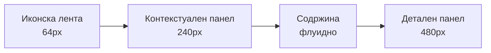

# Design Brief — GoDigital Task Manager

2026-09-20 · @Someone

## 1. Дизајн принципи

Целта не е да личи на Asana, туку да биде полесен од Asana за нашата специфична работа. Тимот веќе знае да работи во Asana, па структурата останува препознатлива, а разликите се таму каде што нашиот процес е поинаков.

### Што го задржуваме

| Образец | Зошто |
| --- | --- |
| Три зони: иконска лента, контекстуален панел, содржина | Навигацијата не го јаде работниот простор |
| Табови за прегледи во заглавието | Тимот веќе ја има навиката |
| Тулбар: примарна акција лево, филтри десно | Исто место секаде, во секој прозорец |
| Детален панел од десно наместо нова страница | Не го губиш контекстот; затвораш и си каде што беше |
| Тивки картички, боја само каде што носи значење | Екран со 60 картички не изморува |
| Активноста како расказ, не како табела | „Драган прикачи · пред 2 дена“ се чита побрзо од лог |

### Каде одиме подобро

1. **Статусот се гледа на картичката.** Asana знае само завршено/незавршено. Нашиот процес има 8–10 статуси и тие мора да се видат без отворање.
2. **Улога, не само аватар.** Доделениот се менува со статусот, па картичката пишува „Монтажер · Дејан“.
3. **Датумот има пет состојби**, не две. Празен резервиран слот е посебна состојба што Asana ја нема.
4. **Капа таскот има сопствен визуелен третман.** Нема еквивалент во Asana, па го измислуваме наместо да го натегнуваме.
5. **Кирилицата е примарна.** Asana користи фонт со слаб кириличен рез — тоа се гледа на секој екран. Со правилен фонт нашиот систем веднаш изгледа поквалитетно.
6. **Прегледот на креативата е преку цел екран**, не во тесен панел. Тоа е екранот каде што се одлучува дали нешто оди кај клиент.

### Правило за боја

Бојата значи нешто или ја нема. Бренд бојата е резервирана за примарна акција и за активна состојба. Сè друго е неутрално, освен семантичките бои за статус и датум. Никогаш боја заради украс.

## 2. Бои

Палетата е изведена од логото: бренд сина `#0866FF` и сива `#E2E7EB` од блокот „DIGITAL“.

### Бренд

| Токен | Светла | Темна | Употреба |
| --- | --- | --- | --- |
| `brand-700` | `#0044B3` | `#0052D9` | Притиснато копче |
| `brand-600` | `#0052D9` | `#0866FF` | Hover на примарно |
| `brand-500` | `#0866FF` | `#3B86FF` | Примарно копче, активен таб, фокус прстен |
| `brand-100` | `#C7DCFF` | `rgba(8,102,255,.28)` | Рамка на модул блок, ленти на напредок |
| `brand-50` | `#EBF2FF` | `rgba(8,102,255,.16)` | Избран ред, активна ставка во мени |
| `brand-04` | `rgba(8,102,255,.04)` | `rgba(8,102,255,.07)` | Позадина на модул блок |

Бренд бојата се користи **само** за: примарна акција, активна навигација, избран ред, фокус. Не за икони, не за заглавија, не за декорација.

### Неутрални

| Токен | Светла | Темна | Употреба |
| --- | --- | --- | --- |
| `bg` | `#FFFFFF` | `#0F1115` | Основна позадина |
| `bg-subtle` | `#F7F8FA` | `#161920` | Табла, панели, заглавија на колони |
| `bg-raised` | `#FFFFFF` | `#1C2029` | Картичка, модал, десен панел |
| `border` | `#E2E7EB` | `#272C36` | Рамки, линии меѓу редови |
| `text` | `#12161C` | `#E8EAED` | Основен текст |
| `text-muted` | `#5C6672` | `#9AA3AF` | Датуми, метаподатоци, помошен текст |
| `text-faint` | `#8A93A0` | `#6B7481` | Празни состојби, плејсхолдери |

### Семантички

| Значење | Светла | Темна |
| --- | --- | --- |
| Успех / одобрено | `#16A34A` | `#22C55E` |
| Предупредување / наближува | `#D97706` | `#F59E0B` |
| Опасност / доцни / празен слот | `#DC2626` | `#EF4444` |
| Инфо | `#0866FF` | `#3B86FF` |
| Неутрално / мирување | `#6B7280` | `#9AA3AF` |

Бидејќи брендот е син, **сината не се користи за статус на работа во тек** — инаку „во тек“ и „примарна акција“ би се мешале. Статусите користат тиркизна, виолетова и магента (Секција 6).

Секоја семантичка боја има и мека варијанта за позадина на чип: иста боја со 10% прозрачност во светла тема, 16% во темна.

### Бои по клиент

Секој клиент добива боја од фиксна палета од 16 нијанси, доделена автоматски и променлива рачно. Таа боја се појавува само како **4px лента лево на картичката** и како точка до името на клиентот. Никогаш како позадина — со 30 клиенти екранот би станал неупотреблив.

### Темна тема

Не е инверзија на светлата. Правила:

- Позадините се слоевити: основа најтемна, издигнатите површини посветли. Без сенки за издигнување — се користи посветла позадина и тенка рамка.
- Семантичките бои се посветли за да го држат контрастот на темно.
- Сликите и креативите се прикажуваат на неутрално сива подлога (`#22262E`), не на црно — црното ги менува впечатокот на бои во графиката.
- Префрлувачот е во менито на профилот, со трета опција „по системот“.

## 3. Типографија

Целиот интерфејс е на македонска кирилица. Фонтот мора да има вистински кириличен рез, не автоматски изведен — тоа е разликата што веднаш се гледа наспроти Asana.

### Избор

**Основен:** Inter. Има целосна кирилица, одличен е на мали големини и е бесплатен.

**Алтернатива:** Manrope, ако сакаш потопол и поспецифичен карактер. Има кирилица, но помалку е тестиран на густи табели.

**Броеви:** секаде каде што бројки се вертикално подредени (табели, датуми, метрики) се користи `font-variant-numeric: tabular-nums`. Без ова колоните со бројки изгледаат криво.

### Скала

| Улога | Големина / линија | Тежина |
| --- | --- | --- |
| Наслов на страница | 20 / 28 | 600 |
| Наслов на секција | 16 / 24 | 600 |
| Наслов на таск во панел | 18 / 26 | 600 |
| Основен текст | 14 / 20 | 400 |
| Наслов на картичка | 14 / 20 | 500 |
| Ред во табела | 14 / 20 | 400 |
| Метаподаток, датум | 13 / 18 | 400 |
| Чип, беџ | 12 / 16 | 500 |
| Етикета на поле | 12 / 16 | 500, `text-muted` |

Максимум две тежини во еден екран: 400 и 500/600. Без курзив освен за системски пораки. Без ГОЛЕМИ БУКВИ во македонски текст — кирилицата губи читливост.

### Читливост

Должина на ред во описи и коментари максимум 72 знака. Имињата на таскови се скратуваат со три точки на едната линија во картичка, на две линии во табела.

## 4. Мрежа и распоред

Густина како Asana — пространа, не збиена. Ова е алатка во која луѓето седат цел ден.

### Распоред на екранот



| Зона | Ширина | Содржина |
| --- | --- | --- |
| Иконска лента | 64 px, фиксна | Лого, Задачи, Календар, Клиенти, Аналитика, Админ, профил долу |
| Контекстуален панел | 240 px, собирлив | Мои задачи, Клиенти, Месеци; се собира на 0 со копче |
| Содржина | Флуидна | Тулбар + активниот преглед |
| Детален панел | 480 px, растеглив 400–720 | Task Detail; преку цел екран со копче за проширување |

Заглавието е високо 56 px и содржи име на активниот преглед, табови и акции десно. Тулбарот е 48 px под него.

### Растојанија

Скала од 4: `4 · 8 · 12 · 16 · 24 · 32 · 48`. Без меѓувредности.

| Елемент | Вредност |
| --- | --- |
| Внатрешно во картичка | 12 px |
| Меѓу картички во колона | 8 px |
| Меѓу колони на табла | 16 px |
| Ширина на колона на табла | 300 px, фиксна |
| Висина на ред во табела | 44 px нормално, 32 px компактно |
| Внатрешно во детален панел | 24 px |
| Заоблување | 8 px картички и полиња, 6 px копчиња, 4 px чипови |

### Сенки

Минимални. Картичката во мирување има само рамка. Сенка добива само при влечење и кај модали и паѓачки менија.

| Ниво | Вредност |
| --- | --- |
| Картичка во мирување | Без сенка, `1px solid border` |
| Картичка во hover | `0 1px 3px rgba(0,0,0,.08)` |
| Картичка при влечење | `0 8px 24px rgba(0,0,0,.16)`, ротација 2° |
| Паѓачко мени, модал | `0 12px 32px rgba(0,0,0,.14)` |

### Точки на прекршување

| Ширина | Однесување |
| --- | --- |
| Над 1440 px | Сè видливо, деталниот панел не ја покрива содржината |
| 1200–1440 px | Деталниот панел лебди над содржината |
| 1024–1200 px | Контекстуалниот панел се собира автоматски |
| Под 1024 px | Мобилен распоред (Секција 10) |

## 5. Компоненти

### Картичка на таск

Ширина 300 px, внатрешно растојание 12 px, лента со бојата на клиентот 4 px лево.

```
│ ▌ Астибо пост 3                    ⋯ │
│ ▌ ● Дизајн                           │
│ ▌ Гр. дизајнер · Драган              │
│ ▌ 📅 3 сеп        💬 2  📎 1   v.2   │
```

Ред по ред:

1. Наслов, до две линии, потоа три точки. Мени со три точки десно, видливо само на hover.
2. Чип со статус — точка во семантичка боја + текст.
3. Улога и име на доделениот. Ако нема доделен: „Недоделен“ во `text-muted`.
4. Подножје: датум со своја боја, број коментари, број прилози, верзија ако е над v.1.

Додатни состојби:

| Состојба | Изглед |
| --- | --- |
| Мртов таск | Испрекината рамка, без содржина, текст „Резервиран слот · 12 сеп“ во `text-faint` |
| Мртов и пропуштен | Испрекината рамка во црвено, црвен текст |
| Итен | Мал црвен триаголник горе десно |
| Застој над 3 дена | Мал часовник со број денови до статусот |
| Има активен модул | Мала икона на модулот во подножјето |

### Чипови

Висина 22 px, заоблување 4 px, текст 12/500, мека позадина во семантичката боја, точка 6 px лево.

Типови: статус · тип содржина (видео/графика) · приоритет · платформа · клиент.

### Копчиња

| Тип | Изглед | Кога |
| --- | --- | --- |
| Примарно | Полна бренд боја, бел текст, 36 px | Една по екран: „Нова задача“, „Продолжи“ |
| Секундарно | Бела позадина, рамка, 36 px | „Откажи“, „Филтер“ |
| Тивко | Без рамка, само текст | Акции во редови, мени |
| Опасно | Црвен текст, црвена рамка | „Врати на доработка“, „Откажи задача“ |
| Split | Примарно + стрелка десно | „Нова задача ▾“ како во Asana |

Висини: 36 px нормално, 28 px во табели и тулбари, 44 px на мобилен.

### Полиња

Висина 36 px, рамка 1 px, заоблување 8 px. Фокус: бренд рамка + прстен 3 px во `brand-50`. Етикетата стои над полето, 12/500 во `text-muted`. Грешката се појавува под полето во црвено, полето добива црвена рамка.

Текстуалните полиња за брифинг и копи се растегливи, минимум 5 реда, со бројач на знаци кога има лимит.

### Аватари

Круг, 24 px во картички и табели, 32 px во деталниот панел, 40 px во профил. Без слика: иницијали на боја изведена од името. Група аватари се преклопува со −8 px, максимум 3 + бројка.

### Табови

Потцртување 2 px во бренд боја под активниот. Текст 14/500. Неактивните во `text-muted`. Без позадина, без рамки.

### Табела

Заглавие лепливо при скролање, позадина `bg-subtle`, текст 12/500 во `text-muted`. Ред: 44 px, линија долу 1 px. Hover: `bg-subtle`. Избран ред: `brand-50` + лента 2 px лево во бренд боја. Првата колона (име) е леплива при хоризонтално скролање.

## 6. Состојби на статус и датум

### Статуси

Секој статус има фиксна боја низ целиот систем — иста на картичка, во табела, во календар, во филтер.

| Статус | Боја | Хекс |
| --- | --- | --- |
| Мртов / резервиран | Сива, испрекината | `#9AA3AF` |
| Подготовка, Брифинг | Сива | `#6B7280` |
| Сценарија, Дизајн, Монтажа | Тиркизна | `#0D9488` |
| Чека режија, Внатрешно одобрување | Виолетова | `#7C3AED` |
| Сценарија кај клиент, Кај клиент | Портокалова | `#D97706` |
| За објавување | Лаймова | `#65A30D` |
| Објавено | Зелена | `#16A34A` |
| Аналитика | Магента | `#DB2777` |
| Пауза | Сива, полупроѕирна | `#9AA3AF` на 60% |
| Откажано | Сива, прецртан наслов | `#6B7280` |

### Датуми

| Состојба | Изглед |
| --- | --- |
| Повеќе од 3 дена до датум | `text-muted`, нормално |
| 1–3 дена | Портокалова |
| Денес | Зелена, полудебело |
| Датумот помина, не е објавено | Црвена, полудебело |
| Резервиран слот без содржина | Црвена, испрекината рамка околу датумот |

Релативни формулации до 7 дена: „денес“, „утре“, „за 3 дена“, „пред 2 дена“. Над тоа апсолутен датум: „12 сеп“.

### Покриеност по клиент

Во директорскиот преглед и до името на клиентот стои мала лента со три состојби: зелена над 14 дена контент нанапред, портокалова 7–14, црвена под 7. Лентата е широка 4 px и висока колку редот.

## 7. Екран по екран

### Мои задачи — стартен екран за сите освен Директор

Првото што секој го гледа при отворање. Без филтри што треба да се местат — таскот што е негов, сортиран по датум.

Три секции една под друга:

| Секција | Содржина |
| --- | --- |
| Доцни | Црвена ознака, најгоре. Ако е празна, секцијата воопшто ја нема |
| Денес и утре | Тоа што мора да се сработи сега |
| Наскоро | Следните 7 дена |

Секој ред: бојата на клиентот, име на таскот, чип со статус, датум десно. Клик отвора детален панел. На врвот една линија: „Имаш 6 задачи, 1 доцни“.

### Список

Табела групирана по клиент, како во твојата Asana. Групите се собирливи, со бројач.

Колони: Име · Статус · Улога и доделен · Датум · Верзија · Прилози. Може да се додаваат и подредуваат, изборот се памети по корисник.

Тулбар: **Нова задача ▾** лево. Десно: филтер за клиент, Филтер, Подреди, Групирај, Опции, пребарување. Компактниот режим е префрлувач во Опции.

### Табла

**Колоните се клиенти**, како сега во Asana. Секоја колона носи име на клиент, точка со неговата боја и број активни таскови.

Две работи го прават подобро од сегашното:

1. **Филтер за клиент во тулбарот.** Избираш еден клиент и таблата покажува само него — тогаш колоните автоматски се префрлаат на **статуси**, па го гледаш целиот тек на тој клиент од лево кон десно. Ова е најкористениот екран за Акаунт менаџер.
2. **Префрлувач „Групирај по“** — Клиент (стандардно) или Статус. Кај групирање по статус, бојата на клиентот на картичката е тоа што ги разликува.

Влечењето меѓу колони е дозволено само кога колоните се статуси и само за преоди што матрицата ги дозволува. Недозволена цел светнува црвено при влечење. При групирање по клиент, влечењето е исклучено.

### Календар

Месечен приказ. Секој ден е ќелија со ленти: една лента по таск, во бојата на статусот, со името на клиентот и типот.

- Празен резервиран слот се гледа како испрекината црвена лента.
- Филтер по клиент горе — еден клиент, повеќе, или сите.
- Префрлувач видео / графика / сè.
- Влечењето на лента на друг ден отвора дијалог за промена на датум со задолжителна причина.
- Клик на ден отвора страничен список со сите таскови за тој ден.

### Директорски преглед

Стартен екран за Директорот. Четири блока:

1. **Покриеност по клиент** — список со лента во боја, сортиран така што најкритичните се најгоре.
2. **Отворени аларми** — со можност за влез во таскот директно.
3. **Работа по статус** — колку таскови има во секој статус, со просечно време во тој статус.
4. **Кампањи во тек** — потрошен буџет, резултати.

### Админ конзола

Одвоен простор, како кај Asana. Друга позадина (`bg-subtle`), лого со беџ АДМИН, сопствена навигација и копче „Назад во системот“ горе лево.

Секции: Клиенти · Вработени и улоги · Календари · Автоматизации · Модули · Сторидж · Извештаи.

Табелата со вработени ја следи структурата од твојот Asana админ: име и мејл во иста ќелија, улога, статус, последна активност, кој го внел, кога. Со филтер и избор на колони.

## 8. Task Detail и капа таск

### Task Detail панел

Се отвора од десно, содржината останува видлива, затворањето те враќа каде што беше. Широк 480 px, растеглив, со копче за проширување преку цел екран.

Одгоре надолу:

| Дел | Содржина |
| --- | --- |
| Лента на акции | Чип со статус лево. Десно: соработници, сподели, линк, прошири, три точки, затвори |
| Наслов | 18/600, може да се менува директно со клик |
| Мета | Клиент, тип, доделен, датум на објава, приоритет — во две колони |
| **Работна зона** | Менува содржина според статусот. Ова е најважниот дел |
| Контекст | Брифинг, сценарио, заеднички материјали од капата — собирливи секции |
| Креатива | Преглед на актуелната верзија + список на претходни |
| Објава | Копи, платформи, линк — само во статус За објавување и подоцна |
| Активност | Коментари и историја, со префрлувач „Коментари / Сè“ |

**Работната зона** е тоа што го прави овој систем поразличен од Asana. Таа секогаш покажува точно што треба да направи тој што го гледа таскот сега:

| Статус | Работна зона содржи |
| --- | --- |
| Брифинг | Поле за текст + прикачување референци + избор на дизајнер |
| Дизајн | Копче за прикачување графика, преглед на брифингот над него |
| Монтажа | Сценариото, суровиот материјал, копче за прикачување монтирано |
| Внатрешно одобрување | Преглед на креативата + две копчиња: Одобри · Врати со коментар |
| Кај клиент | Три копчиња: Одобрено · Одобрено со измени · Врати, + поле за коментар |
| За објавување | Поле за копи, избор на платформи, копче за симнување, поле за линк |
| Аналитика | Две копчиња: Органски · Во реклами, + метрики под нив |

Ако корисникот ја нема улогата за тој статус, работната зона е видлива, но заклучена, со една линија: „Чека Монтажер · Дејан“.

### Преглед на креатива

Клик на креативата отвора преглед преку цел екран: медиумот во средина на неутрална подлога, коментарите десно во лента од 320 px, верзиите долу како мали сликички. Тука Режисерот и Графичкиот креатор ќе поминат најмногу време — затоа не е во тесниот панел.

### Капа таск — банер

Капа таскот нема еквивалент во Asana, па добива сопствен третман: **широк банер на врвот на групата**, не картичка меѓу другите.

```
┌────────────────────────────────────────────────┐
│ 🎬 Астибо · Видео · Септември                  │
│ ①Подготовка ─── ②Сценарија ─── ③Снимање        │
│ Снимање: 12 сеп, 10:00, Штип · Сценарист: Стефан│
│ 5 од 6 сценарија одобрени                       │
└────────────────────────────────────────────────┘
```

- Трите чекори се хоризонтална лента: завршен со зелена чека, активен во бренд боја со дебела линија, иден во сиво.
- Под нив стои најважниот податок за моментот — терминот на снимање и сценаристот.
- Бројач на активирани таскови десно.
- Кога капа таскот ќе се затвори, банерот се собира во една линија со зелена чека и текст „Капа затворена · 5 таска во тек“. Може да се отвори со клик.

## 9. Модул блок

Најважното барање: во секој таск да може да се активира модул. Модулот не смее да биде уште едно копче меѓу другите, ниту да лебди настрана.

### Каде стои

Внатре во Task Detail панелот, **непосредно над работната зона** за тековниот статус. Тоа значи дека вработениот прво го гледа модулот, па рачната алтернатива под него — природен редослед, бидејќи модулот е побрз пат до истиот резултат.

### Како изгледа

```
┌──────────────────────────────────────────┐
│ ✨ GoScripterAI                          │
│ Генерира сценарија од базата на Астибо   │
│                      [ Генерирај ▸ ]     │
└──────────────────────────────────────────┘
```

| Својство | Вредност |
| --- | --- |
| Позадина | Многу мека бренд нијанса, 4% прозрачност |
| Рамка | 1 px во бренд боја на 20% прозрачност |
| Икона | Специфична за модулот, 20 px, во бренд боја |
| Наслов | 14/600 |
| Опис | 13/400 во `text-muted`, една линија |
| Акција | Примарно копче, десно долу |

Блокот е визуелно поинаков од сè друго во панелот — тоа е единственото место каде што бренд бојата се користи како позадина.

### Правила

1. Се појавува **само** ако Директорот го доделил модулот на тој клиент и само во статусот каде што има смисла.
2. Ако не е доделен — блокот воопшто го нема. Без сиво копче, без празно место, без „надгради“.
3. Кога модулот работи, копчето станува индикатор на напредок со можност за откажување.
4. Резултатот се спушта **во работната зона под блокот**, како обичен прилог или текст. Вработениот го прегледува, коригира и продолжува рачно.
5. Ако модулот падне, се појавува една линија со грешка и предлог за повторен обид. Рачниот пат никогаш не се блокира.

### По модул

| Модул | Статус | Копче | Резултат оди во |
| --- | --- | --- | --- |
| GoScripterAI | Капа: Сценарија | Генерирај сценарија | Поле за документ со сценарија |
| GraficarAI | Таск: Дизајн | Генерирај графика | Прилози како верзија |
| AI копирајтер | Таск: За објавување | Напиши копи | Полето за копи |
| Claude помошник | Секаде | Прашај | Страничен разговор, не менува податоци |

Claude помошникот е исклучок — тој не е блок во работната зона, туку копче во лентата на акции горе десно, што отвора тесен разговор од 360 px врз панелот.

## 10. Мобилно

Сите екрани работат на телефон, но четири улоги се навистина мобилни и тие се дизајнираат прво за мал екран.

| Улога | Што прави на телефон |
| --- | --- |
| Камерман | Го гледа терминот на снимање, качува суров материјал директно од терен |
| Монтажер | Прегледува материјал и коментари, менува статус; монтира на компјутер |
| Акаунт менаџер | Пишува копи, симнува креатива, објавува, внесува линк — сето на телефон |
| Директор | Покриеност и аларми, каде и да е |

### Промени под 1024 px

- Иконската лента и контекстуалниот панел стануваат долна лента со 5 ставки: Мои задачи · Календар · Клиенти · Аларми · Профил.
- Деталниот панел се отвора преку цел екран, со стрелка назад.
- Таблата станува вертикален список со групи што се собираат; без влечење.
- Календарот е неделен, не месечен.
- Сите допирни цели минимум 44×44 px.
- Примарната акција на екранот е лебдечко копче долу десно.

### Качување од телефон

Најважниот мобилен тек. Камерманот отвора таск, допира „Качи материјал“, избира од галерија или снима директно. Качувањето продолжува во позадина со видлив напредок и се обновува по прекин на врска. Големите фајлови се качуваат во делови — на терен врската паѓа.

### PWA

Системот се инсталира како апликација на почетен екран. Офлајн: последно вчитаните таскови се читливи, а промените што се направени офлајн чекаат во ред и се испраќаат кога ќе се врати врската.

## 11. Состојби на системот

### Празни состојби

Секогаш иста структура: едноставна линиска илустрација, една реченица што објаснува, едно копче со следниот чекор. Без духовити пораки.

| Екран | Текст |
| --- | --- |
| Мои задачи, празно | „Нема задачи за тебе во моментот.“ |
| Клиент без месец | „Септември уште не е испланиран.“ + копче „Генерирај распоред“ |
| Табла без резултат од филтер | „Нема задачи што одговараат на филтерот.“ + копче „Исчисти филтри“ |
| Нема аларми | „Сè е во ред.“ со зелена чека |

### Вчитување

Skeleton екрани со точниот облик на содржината што доаѓа, не вртелешки. Табелата покажува сиви правоаголници со висина на ред, таблата покажува празни картички. Без треперење: ако одговорот стигне под 200 ms, skeleton воопшто не се појавува.

### Грешки

| Тип | Приказ |
| --- | --- |
| Поле | Црвен текст под полето, црвена рамка |
| Недозволен преод | Toast долу десно, 4 секунди, со објаснување зошто |
| Неуспешно зачувување | Постојана лента на врвот со копче „Обиди пак“ |
| Изгубена врска | Сива лента на врвот: „Нема врска. Промените ќе се испратат подоцна.“ |

Грешката секогаш кажува што да се направи, не само што не успеало.

### Известувања

| Ниво | Приказ |
| --- | --- |
| Потсетник | Точка на иконата за аларми, ставка во списокот |
| Аларм | Toast при отворање + ставка во списокот + мејл |
| Критичен | Модал што бара потврда дека е видено + мејл + Viber до Директор |

Списокот на аларми е панел од десно со групирање по клиент. Секој аларм има копче што води директно во таскот.

### Движење

Брзо и тивко. Отворање панел 200 ms, toast 150 ms, hover 100 ms. Крива `ease-out`. Влечењето нема анимација на пуштање — картичката се спушта веднаш. Без потскокнувања и без анимации што се повторуваат.

## 12. Достапност и предавање

### Достапност

- Контраст најмалку 4.5:1 за текст, 3:1 за икони и рамки. Проверено и во темна тема.
- Бојата никогаш не е единствениот носител на значење: статусот има и текст, датумот што доцни има и икона.
- Целосна навигација со тастатура. Фокус прстенот е секогаш видлив, 3 px во `brand-50`.
- Кратенки: `N` нова задача, `/` пребарување, `Esc` затвори панел, `J`/`K` следен и претходен ред.
- Илустрациите и иконите имаат текстуална алтернатива на македонски.

### Што да не се прави

1. Без бренд боја како позадина на големи површини. Едно исклучок: модул блокот.
2. Без повеќе од една примарна акција на екран.
3. Без модал таму каде што панел е доволен.
4. Без сиви исклучени копчиња — ако нешто не е достапно, го нема.
5. Без ГОЛЕМИ БУКВИ во македонски текст.
6. Без икони без текст во примарна навигација.
7. Без боја на клиент како позадина на картичка.

### Што се предава

| Испорака | Содржина |
| --- | --- |
| Токени | Бои, типографија, растојанија, сенки, заоблувања — како CSS променливи и JSON |
| Библиотека компоненти | Секоја компонента од Секција 5 во сите состојби: мирување, hover, фокус, активна, заклучена, грешка |
| Мокапи | Секој екран од Секција 7, во светла и темна тема |
| Мокапи на Task Detail | По еден за секој статус, со точната работна зона |
| Мобилни мокапи | Мои задачи, Task Detail, качување, објавување |
| Прототип | Еден целосен тек: од мртов таск до објавено |

### Отворено

| # | Прашање |
| --- | --- |
| 1 | Точните GoDigital бои во хекс, и дали има фонт што веќе се користи во брендот |
| 2 | Дали постои GoDigital икона/лого во светла верзија за темна тема |
| 3 | Дали сакаш ист дизајн систем да се користи и за идната PWA за клиенти |
