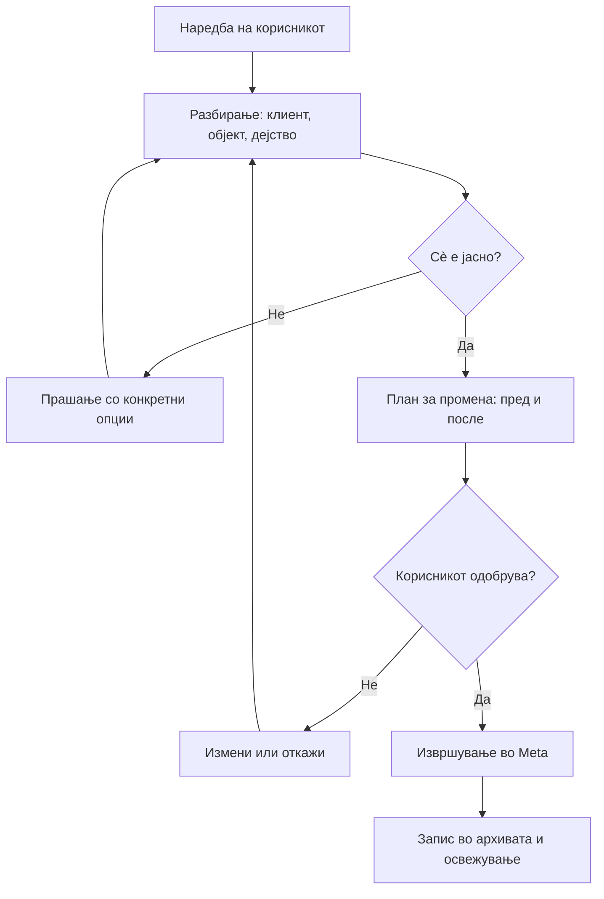
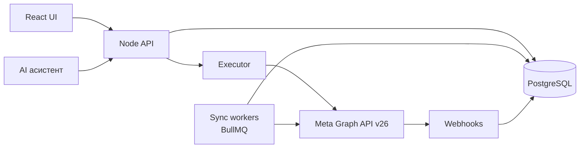

# PRD — GoAds: Meta Ads & Social Operations System (v1.0)

Sep 22, 2026 · @GoDigital

## 1. Резиме и цел на производот

GoAds е интерна веб-апликација преку која еден човек управува со Meta рекламите, органските резултати, пораките и коментарите на сите клиенти на GoDigital (\~30 активни рекламни акаунти денес, до 80 во иднина), со AI асистент што разбира наредби на македонски, прашува кога нешто не е јасно и извршува само потврдени промени.

Денес сопственикот отвора рекламни акаунти рачно 3 пати неделно за проверка, резултатите ги прегледува еднаш неделно акаунт по акаунт, а новите видеа ги додава и сетира рачно за секој клиент. При 30+ клиенти тоа е бавно и подложно на пропусти: одбиени реклами, потрошени лимити и паднати плаќања поминуваат незабележано со денови.

**Клучен продуктов принцип:** софтверот не е автопилот. Media buying одлуките (Objective, буџет, дестинација на конверзија, кога се додава публика) ги носи човекот. Софтверот е прецизен извршител, набљудувач и аналитичар. Ова свесно се разликува од светските алатки (AdAmigo, Ryze, Madgicx) што се обидуваат автономно да купуваат медиум; одлуката ја намалува површината на ризик врз туѓи рекламни акаунти и го фокусира v1.0 таму каде што е вредноста: брзина, видливост и нула пропуштени проблеми.

Три исходи што v1.0 ги гарантира:

1. Сопственикот не отвора Ads Manager за да знае дали сè работи — системот го известува.
2. Рутинска промена (ново видео во ad set, буџет, копиран ad set) се прави со разговор за под една минута, со потврда пред извршување.
3. Секоја промена, рачна или преку ботот, е трајно запишана по клиент, со состојба пред и после.

## 2. Проблем, корисници и мерки на успех

Проблемот не е недостиг на алатки, туку тоа што работата е раскината на 30+ Ads Manager акаунти, Meta Business Suite инбокси и Insights табови, без заедничко место, без историја на промени и без начин да се види состојбата на сите клиенти одеднаш.

### Корисници (персони)

| Улога                    | Кој        | Што прави во системот                                   | Приоритет                      |
| ------------------------ | ---------- | ------------------------------------------------------- | ------------------------------ |
| Media Buyer / сопственик | Александар | Сè: алерти, промени, наредби кон ботот, анализа, инбокс | Примарен, v1.0                 |
| Акаунт менаџер           | хонорарец  | Чита резултати и пораки по клиент, подготвува извештаи  | Секундарен, v1.0 (само читање) |
| Аналитичар               | хонорарец  | Извештаи и споредби низ клиенти                         | Секундарен, Ф4                 |
| Клиент                   | надворешен | Нема пристап во v1.0                                    | Вон опфат                      |

### Мерки на успех (мерливи, 60 дена по Ф2)

| Метрика                                                                                         | Денес                  | Цел                          |
| ----------------------------------------------------------------------------------------------- | ---------------------- | ---------------------------- |
| Време за дневна проверка на сите акаунти                                                        | 45–90 мин, 3× неделно  | < 5 мин дневно, преку алерти |
| Време од настанување на проблем до откривање (одбиена реклама, паднато плаќање, потрошен лимит) | до 3 дена              | < 60 мин                     |
| Време за додавање ново видео во постоечки ad set                                                | 5–8 мин во Ads Manager | < 60 сек преку чат           |
| Промени со целосна ревизорска трага                                                             | 0%                     | 100%                         |
| Отворања на Ads Manager неделно                                                                 | \~15                   | < 3                          |

### Ограничувања што ги диктираат одлуките

- Рекламните акаунти се сопственост на клиентите; GoDigital има Partner пристап. Грешка на системот е грешка врз туѓ буџет.
- Буџетите се мали (€1,76–€20 дневно по кампања). Погрешно зголемување од 10× е видливо истиот ден.
- Целиот UI и сите извештаи се на македонски кирилица.
- Тимот е мал; системот мора да работи без дежурен оператор.

## 3. Опфат: во и вон опфат за v1.0

### Во опфат

- Читање и прикажување на сите кампањи, ad sets и реклами од сите поврзани рекламни акаунти, со креативата (слика, видео, текст, CTA).
- Автоматски алерти за здравје на акаунтите и рекламите.
- Органски постови по клиент со визуел и метрики, со врска кон рекламите што ги користат.
- Рачно менување: пауза/старт, буџет, распоред, нова реклама од постоечки пост, копирање ad set, нов ad set, нова кампања.
- Инбокс за читање: пораки (Messenger, Instagram Direct) и коментари (органски и на реклами).
- AI асистент со протокол на потврда за промени и слободна аналитика за читање.
- Архива на промени по клиент со состојба пред и после и враќање назад каде што е можно.
- Извештаи по клиент со метрики според Objective.

### Вон опфат за v1.0 (не е одбиено, туку одложено)

| Функција                                       | Причина                                                                                | Кога                            |
| ---------------------------------------------- | -------------------------------------------------------------------------------------- | ------------------------------- |
| Одговарање на пораки и коментари од системот   | Дозволите го овозможуваат, но процесот на одобрување и шаблоните бараат посебен дизајн | v1.1                            |
| Објавување органски постови                    | Не е потреба; ја зголемува површината на ризик                                         | Не е планирано                  |
| Автономни оптимизации без потврда              | Спротивно на продуктовиот принцип                                                      | Не е планирано                  |
| Генерирање креатива (видео, слика, текст)      | Покриено со GoReel и GraficarAI                                                        | Интеграција подоцна             |
| Пристап за клиенти (client portal)             | Бара улоги, брендирање и правна проверка                                               | v2.0                            |
| Google Ads, TikTok, LinkedIn                   | Друг API, друга логика                                                                 | v2.0                            |
| Плаќања, картички, фактури кон Meta            | API не го дозволува                                                                    | Никогаш                         |
| Уредување на Advantage+ Shopping (ASC) кампањи | Meta ги гаси преку API и ги паузира во v26.0                                           | Само детекција и предупредување |

### Претпоставки

- Сите рекламни акаунти се веќе споделени со бизнис портфолиото на GoDigital преку Partner пристап.
- Најмалку 90% од нив се споделени со задача што дозволува менување („Manage campaigns“); останатите се третираат како „само читање“ и системот тоа јасно го покажува.
- Апликацијата работи на постоечкиот Hetzner стек (Node.js, PostgreSQL, Redis, BullMQ, Docker) со React фронтенд.

## 4. Пристап и безбедност: Meta System User токени, дозволи, ротација

Системот се автентицира кон Meta со **System User токени** од бизнис портфолиото „Go Digital Skopje“, никогаш со личен User токен на сопственикот. Личниот токен истекува на \~60 дена, паѓа при промена на лозинка или security проверка, и ги врзува сите дејства за едно физичко лице.

### Два системски корисници, два токени

| Системски корисник | Намена                      | Дозволи                                                                                                                                                                                                                     |
| ------------------ | --------------------------- | --------------------------------------------------------------------------------------------------------------------------------------------------------------------------------------------------------------------------- |
| GoAds Monitor      | Реклами и органски insights | `ads_read`, `ads_management`, `business_management`, `pages_show_list`, `pages_read_engagement`, `pages_manage_ads`, `instagram_basic`, `read_insights`, `instagram_manage_insights`, `pages_manage_metadata` (за webhooks) |
| GoInbox Monitor    | Пораки и коментари          | `pages_messaging`, `instagram_manage_messages`, `pages_read_user_content`, `pages_read_engagement`, `instagram_manage_comments`, `pages_show_list`, `pages_manage_metadata`                                                 |

По избор, според клиент: `leads_retrieval` (проверка дали лидовите пристигнуваат), `catalog_management` (клиенти со каталог), `attribution_read`.

Поделбата на два токена е свесна: ако еден треба да се повлече или протече, другиот продолжува да работи, а штетата е ограничена. Постоечкиот „Conversions API System User“ **не се користи** — повлекување на неговите токени би ги срушило CAPI интеграциите на клиентите.

### Правила

- Токените се чуваат шифрирани (KMS или sops/age), никогаш во Git, никогаш во логови, никогаш во чат.
- Ротација на 90 дена, со процедура „генерирај нов → замени → повлечи стар“ без прекин.
- `debug_token` се вика при стартување и еднаш дневно; истек или повлечен токен е алерт со највисок приоритет.
- Апликацијата е тип Business, во сопственост на бизнис портфолиото, со завршена Business Verification и побаран **Advanced Access** за `ads_read` и `ads_management` (Standard Access има прениски rate limits за 30+ акаунти).
- Ако клиент споделил асет само со „View performance“, системот тоа го детектира и акаунтот го обележува како „само читање“; секој обид за промена таму е блокиран во UI, не само во API.

### Важно ограничување на дозволите

Кај пораките и коментарите Meta нема одвоена дозвола „само читање“: `pages_messaging` и `instagram_manage_messages` овозможуваат и праќање, а `instagram_manage_comments` и одговарање и бришење. Затоа ограничувањето во v1.0 е **на ниво на апликација**: не се имплементираат ендпоинти за праќање и за бришење. Ова мора да е јасно во code review — не постои техничка пречка, само дисциплина во кодот.

## 5. Домен модел и структура на податоци

Системот држи сопствена копија (mirror) на податоците од Meta во PostgreSQL. Прикажувањето секогаш оди од базата за брзина; менувањето секогаш оди директно во Meta, а потоа следи освежување на копијата.

### Главни ентитети

| Ентитет                    | Клучни полиња                                                                                                                            | Извор        |
| -------------------------- | ---------------------------------------------------------------------------------------------------------------------------------------- | ------------ |
| `client`                   | име, статус, пакет, валута, белешки, цели по метрика                                                                                     | GoAds        |
| `ad_account`               | meta\_id (`act_…`), име, валута, статус, лимит, ниво на пристап (read/write)                                                             | Meta         |
| `page` / `ig_account`      | meta\_id, име, поврзан клиент                                                                                                            | Meta         |
| `campaign`                 | meta\_id, име, objective, buying\_type, budget\_strategy, дневен буџет, bid strategy, статус, effective\_status                          | Meta         |
| `ad_set`                   | meta\_id, име, conversion\_location, performance\_goal, destination, таргетирање (JSONB), placements (JSONB), распоред, learning\_stage  | Meta         |
| `ad`                       | meta\_id, име, статус, review\_status, creative\_id, извор (постоечки пост или ново качено), CTA, шаблон за пораки, enhancements (JSONB) | Meta         |
| `creative_asset`           | видео/слика, thumbnail, времетраење, локален кеш                                                                                         | Meta + кеш   |
| `organic_post`             | meta\_id, тип, датум, текст, визуел, метрики, дали е користен во реклама                                                                 | Meta         |
| `insight_daily`            | сноп метрики по ден и по ниво (кампања, ad set, реклама)                                                                                 | Meta         |
| `conversation` / `message` | ниту, испраќач, текст, време, прочитано                                                                                                  | Meta         |
| `comment`                  | објект, автор, текст, време, реклама или пост                                                                                            | Meta         |
| `alert`                    | тип, сериозност, клиент, објект, статус, кога е видено                                                                                   | GoAds        |
| `change_plan`              | наредба на корисникот, разбрани параметри, план, статус                                                                                  | GoAds        |
| `change_log`               | што, кој, кога, пред, после, резултат                                                                                                    | GoAds        |
| `client_template`          | шаблони за пораки, Instant Forms, CTA, UTM, преферирани поставки                                                                         | GoAds + Meta |

### Правила на моделот

- Сè се врзува преку **Meta ID**, никогаш преку имиња. Имињата на кампањите не се конзистентни низ клиентите и се менуваат.
- Еден клиент може да има повеќе рекламни акаунти, страници и IG профили; еден рекламен акаунт може да опслужува повеќе брендови (пример: StayLux страница со кампањи за Booking Expert).
- Валутата се чува по рекламен акаунт (постојат акаунти во USD и во EUR) и никогаш не се конвертира тивко. Кога се прикажуваат збирни суми низ клиенти, конверзијата е експлицитна, со курс и датум.
- `insight_daily` се чува по ден за 24 месеци наназад, за споредби година на година.
- Бројките за конверзии и продажби се менуваат неколку дена наназад (Meta ги доуредува); затоа секој ред носи `fetched_at` и последните 7 дена се освежуваат повторно секоја ноќ.

## 6. Модул М1: Клиенти и профил на клиент

Профилот на клиент е местото каде системот го памти контекстот што ботот го користи за да прашува попаметно. Тој **не содржи правила за автоматско одлучување** — ботот не смее да преземе дејство врз основа на профилот без потврда.

### Екран: листа на клиенти

Табела со сите клиенти: име, поврзани акаунти, потрошено денес и овој месец, број на активни кампањи, број на отворени алерти, непрочитани пораки. Сортирање по алерти. Ова е втората најпосетувана страница по Утринскиот преглед.

### Екран: профил на клиент

1. **Поврзувања** — рекламни акаунти, страници, IG профили, каталози, пиксели (dataset ID), со ниво на пристап и статус.
2. **Белешки за клиентот** — слободен текст што сопственикот го внесува и го дополнува преку чат („STAFF: секоја дестинација е посебна кампања; таргетираме само Скопје“). Ботот ги чита за да предложи и да прашува, никогаш за да одлучи.
3. **Шаблони и ресурси** — зачувани шаблони за пораки, Instant Forms, стандардни CTA, UTM шема, каталози.
4. **Цели по метрика** (по избор) — на пр. „целна цена по порака под $1,5“, „целна ROAS над 3“. Без цел, системот ги покажува само бројките без оценка.
5. **Конвенција за именување** — по клиент, за да може ботот да ги препознае наредбите изразени со зборови („кампањата за 11 октомври“).

### Барања

- Ф1: автоматско пополнување на поврзувањата со скрипта за ревизија што ги чита сите акаунти преку токенот.
- Промена во профилот се запишува во архивата исто како промена во Meta.
- Клиент може да се обележи како неактивен, при што синхронизацијата запира, а историјата останува.

## 7. Модул М2: Утрински преглед и алерти

Ова е почетниот екран и главната замена за трите неделни рачни проверки. Прикажува само отстапувања, не сè што работи нормално.

### Каталог на алерти

| Код | Алерт                                                  | Сериозност   | Извор                               | Праг                                                       |
| --- | ------------------------------------------------------ | ------------ | ----------------------------------- | ---------------------------------------------------------- |
| A01 | Реклама одбиена при преглед                            | Критичен     | webhook + sync                      | веднаш                                                     |
| A02 | Рекламен акаунт оневозможен или ограничен              | Критичен     | `account_status`, `disable_reason`  | веднаш                                                     |
| A03 | Проблем со плаќање (неуспешна наплата)                 | Критичен     | статус на акаунт                    | веднаш                                                     |
| A04 | Достигнат или близок лимит на потрошувачка на акаунтот | Критичен     | `spend_cap` наспроти `amount_spent` | над 90%                                                    |
| A05 | Активна кампања не троши                               | Висок        | insights                            | 0 потрошено 24 ч со активен статус                         |
| A06 | Реклама не се испорачува иако е активна                | Висок        | `effective_status`, `issues_info`   | веднаш                                                     |
| A07 | Цена по резултат значително пораснала                  | Среден       | insights                            | +40% споредено со претходни 7 дена, мин. праг потрошувачка |
| A08 | Ad set заглавен во Learning Limited                    | Среден       | `learning_stage_info`               | над 5 дена                                                 |
| A09 | Frequency над праг                                     | Среден       | insights                            | frequency > 3 за 7 дена (прилагодливо по клиент)           |
| A10 | Кампања со краен датум истекува за 48 часа             | Информативен | распоред                            | 48 ч                                                       |
| A11 | Страница или IG профил недостапен за системот          | Висок        | грешка при sync                     | 2 неуспешни обиди                                          |
| A12 | Токен истекува или е повлечен                          | Критичен     | `debug_token`                       | 7 дена пред истек                                          |
| A13 | Legacy Advantage+ Shopping кампања открена             | Информативен | objective/тип                       | еднаш                                                      |

### Однесување

- Секој алерт е врзан за клиент и за конкретен објект, со длабока врска до внатрешниот екран и до Ads Manager.
- Состојби: нов → видено → решено (автоматски кога условот исчезне) или одложено („потсети ме утре“).
- Истиот алерт не се повторува секој циклус; се групира и се брои („3-ти ден по ред“).
- Известувања: во апликацијата секогаш; критичните дополнително на Viber или email, еднаш дневно збирно во 08:30, а A01–A04 веднаш.
- Праговите (A07, A09) се менуваат по клиент во профилот.

### Прифатен критериум

При тест со намерно одбиена реклама и намерно исцрпен лимит на тест акаунт, алертот се појавува за под 15 минути (webhook) односно во првиот следен циклус на синхронизација (најмногу 60 минути).

## 8. Модул М3: Органика по пост со визуел

Овој модул не е само извештај — тој е и изворот на креативи за рекламите. Бидејќи GoDigital гради реклами од постоечки постови („Use existing posts“), наредбата „додади го видеото објавено вчера“ се решава токму овде.

### Екран: постови на клиент

Мрежа или листа со филтри по мрежа (Facebook, Instagram), тип (видео, слика, карусел, reel), период и дали постот е искористен во реклама.

За секој пост се прикажува:

- Визуел: слика или **видео плеер во апликацијата** (не само сличица)
- Текст на постот, датум и време на објава
- Метрики: views, reach, engagement, лајкови, коментари, споделувања, зачувувања; за видео дополнително просечно време на гледање и задржување
- Ознака „во реклама“ со листа на реклами што го користат постот
- Дејство: **Користи во реклама** → отвора тек за додавање реклама во постоечки или нов ad set

### Барања

- Сортирање: најнови, најмногу views, најмногу engagement, најслаби.
- Споредба период со период за целиот профил (оваа недела наспроти минатата, овој месец наспроти минатиот).
- Медиумите се кешираат локално (сличици и видеа) за да не зависи прикажувањето од привремените Meta линкови, кои истекуваат.
- Instagram и Facebook постовите се прикажуваат заедно и одделно; ист креатив објавен на двете мрежи се поврзува визуелно, но метриките остануваат одвоени.

### Внимание при мапирање на метрики

Meta ги менува органските метрики: старите reach и impressions се заменуваат со Views, а legacy reach преминува во Viewers. Мапирањето на метрики се чува во конфигурација, со верзија на API, за да може да се смени без промена на кодот. Секој график носи ознака за периодот и за тоа која метрика е употребена.

## 9. Модул М4: Менаџмент на реклами (рачно)

Сè што ботот може да направи, корисникот мора да може да го направи и рачно, со ист резултат и со ист запис во архивата. Ботот и UI-то повикуваат **иста внатрешна услуга** — никогаш две различни имплементации.

### Екран: дрво на кампањи

Кампања → ad set → реклама, со статус, буџет, резултат според Objective, цена по резултат, потрошено. На ниво на реклама се прикажува визуелот, текстот, CTA, шаблонот за пораки и статусот на прегледот кај Meta.

### Операции во v1.0

| #   | Операција                                             | Влез                                          | Забелешки                                                                             |
| --- | ----------------------------------------------------- | --------------------------------------------- | ------------------------------------------------------------------------------------- |
| O1  | Пауза / активирање (кампања, ad set, реклама)         | објект                                        | —                                                                                     |
| O2  | Промена на дневен буџет на кампања                    | износ                                         | Буџетот е на ниво на кампања (CBO) кај сите постоечки клиенти                         |
| O3  | Закажано зголемување на буџет                         | период, износ                                 | Како кај KC Home: +€2 за викенди                                                      |
| O4  | Додавање реклама во постоечки ad set од органски пост | ad set, пост                                  | Ги наследува CTA, шаблон, enhancements и tracking од постоечките реклами во ad set-от |
| O5  | Качување ново видео и креирање реклама                | видео, ad set, текст, CTA                     | Кога креативата не е објавена органски                                                |
| O6  | Копирање ad set со бришење на старите реклами         | изворен ad set, нова креатива, име            | Најчестото барање на корисникот                                                       |
| O7  | Креирање нов ad set                                   | целосни поставки                              | Системот ги предлага од најсличниот ad set во кампањата                               |
| O8  | Креирање нова кампања                                 | Objective, дестинација, буџет, датум, ad sets | Стандарди: Auction, CBO, Highest volume                                               |
| O9  | Промена на распоред (почеток, крај, ongoing)          | датуми                                        | —                                                                                     |
| O10 | Менување CTA, линк, Instant Form, шаблон за пораки    | објект, вредност                              | Од листа, не со слободен внес                                                         |
| O11 | Преименување на објект                                | ново име                                      | Според конвенцијата на клиентот                                                       |
| O12 | Дуплирање кампања                                     | извор, име, датум                             | За повторливи понуди и дестинации                                                     |

### Вградени стандарди на GoDigital (default при креирање)

Изведени од ревизијата на постоечките кампањи; секој е **предлог што може да се прегази**, не тврдо правило:

- Buying type: Auction; Budget strategy: Campaign budget (CBO); Bid strategy: Highest volume, без cost cap.
- Placements: рачни, без Audience Network, освен ако корисникот не побара Advantage+ placements.
- Advantage+ creative enhancements: Text improvements исклучено; се копираат поставките од соседните реклами во истиот ad set.
- Реклама се гради од постоечки пост кога постот постои (се задржуваат лајковите и коментарите).
- Препораките на Meta („Apply Advantage+ placements“, „Advantage+ audience“) **никогаш не се применуваат автоматски**; се прикажуваат како информација.

### Заштити во UI

- Промена на буџет над +20% или над лимитот на клиентот бара дополнителна потврда со внесување на износот.
- Пред создавање или копирање ad set се прикажува предупредување дека ad set-от влегува во learning фаза и дека го дели буџетот на кампањата.
- Акаунт со ниво „само читање“ ги прикажува сите дејства како недостапни, со објаснување.

## 10. Модул М5: Инбокс — пораки и коментари

Во v1.0 инбоксот е **само за читање и разбирање**. Целта е сопственикот да знае што се случува кај клиентот без да отвора Business Suite, и да може да го праша ботот за резиме.

### Екран: инбокс по клиент

- Разговори од Messenger и Instagram Direct, со целосна историја на пораките
- Коментари: органски и на реклами, со врска до постот или рекламата
- Филтри: непрочитани, денес, оваа недела, само прашања, само коментари на реклами
- Означување: „обработено“, „за клиентот“, „важно“ (внатрешни ознаки, не се праќаат кон Meta)

### AI резимеа (на барање)

Корисникот прашува, системот одговара од податоците: колку нови пораки, главни теми, колку прашуваат цена, колку се жалби, кои бараат итен одговор. Резимето секогаш го наведува периодот и бројот на обработени разговори, и не измислува броеви.

### Технички барања

- Webhook-и за нови пораки и коментари (потребна дозвола `pages_manage_metadata`), со синхронизација како резерва на секои 15 минути.
- **Instagram предуслов по клиент:** во Instagram Settings → Messages → Connected tools мора да е вклучено „Allow access to messages“. Без тоа API-то не ги враќа DM-овите, и тоа е најчестата причина за „нема пораки“. Системот го детектира и покажува алерт за конкретниот клиент со упатство што да се вклучи.
- Пораките постари од Meta-ините лимити за преземање не се достапни ретроактивно; системот собира од моментот на поврзување наваму.

### Приватност

Пораките содржат лични податоци на купувачите на клиентите. Затоа:

- Пристапот е по улога и по клиент, не сите гледаат сè.
- Секое отворање на разговор се логира.
- Рок на чување: 12 месеци, потоа автоматско бришење на телото на пораката, со задржување само на бројки за статистика.
- Со клиентите се потпишува додаток кон договорот што го покрива ова (види дел 16).

## 11. Модул М6: AI асистент — каталог на операции, протокол на потврда

Асистентот е слој за разбирање и извршување, не за одлучување. Тој има две групи алатки: **алатки за читање**, кои ги користи слободно, и **алатки за пишување**, кои не пишуваат во Meta, туку креираат `change_plan` што чека потврда.

### Тек на една наредба

### Правила на асистентот (мора да се одразат во системскиот промпт и во кодот)

1. **Никогаш не одлучува место корисникот.** Нема сопствена иницијатива за Objective, буџет, публика, гасење или препораки на Meta.
2. **При секаков сомнеж — прашува**, со најмногу 2–3 конкретни прашања одеднаш, секогаш со опции преземени од вистинските податоци.
3. **Никогаш не претпоставува идентитет.** Ако „кампањата за 11 октомври“ одговара на две кампањи, ги нуди двете. Ако ad set со дадено име не постои (пример: корисникот вели „адсетот Скопје“, а ad set-овите се именувани „Broad - Fb/Ig - Video“), ги наведува кандидатите со нивното таргетирање.
4. **Планот е обврзувачки.** Се извршува точно тоа што е во планот, ништо повеќе. Промена на планот значи нов план и нова потврда.
5. **Ги објаснува последиците**: влез во learning фаза, влијание врз буџетот, дали нешто ќе се паузира.
6. **Ги означува несогласувањата.** Пример од ревизијата: кампања за 11 октомври што користи шаблон за пораки именуван „Banjite“ — асистентот прашува дали е намерно.
7. **Не измислува бројки.** Ако податок недостига, го кажува тоа.
8. **Пишува на македонски кирилица.**

### Каталог на операции: што бара од корисникот, што копира сам

| Операција                          | Мора да каже корисникот                       | Асистентот копира сам                                                | Кога прашува                                                  |
| ---------------------------------- | --------------------------------------------- | -------------------------------------------------------------------- | ------------------------------------------------------------- |
| Додај реклама во постоечки ad set  | клиент, кампања, ad set, пост или видео       | CTA, шаблон за пораки, enhancements, tracking од постоечките реклами | ако постоечките реклами имаат различни CTA или шаблони        |
| Копирај ad set без старите реклами | изворен ad set, нова креатива                 | целото таргетирање, placements, goal                                 | име на новиот ad set; предупредува за learning и делење буџет |
| Нов ad set                         | локација, возраст, пол, публика, placements   | Objective и goal од кампањата                                        | за сè некажано; предлага од најсличниот ad set                |
| Нова кампања                       | Objective, дестинација, буџет, датум, ad sets | стандардите од дел 9                                                 | за сè некажано                                                |
| Промена на буџет                   | кампања, износ                                | —                                                                    | дали е веднаш или закажано; при промена над 20%               |
| Пауза или старт                    | објект                                        | —                                                                    | при повеќе совпаѓања                                          |
| Смена на шаблон, CTA, линк, форма  | што и каде                                    | —                                                                    | ако името е двосмислено                                       |
| Прашање за резултати               | што го интересира                             | период по дифолт 7 дена                                              | ако периодот не е кажан, го наведува употребениот             |

### Архитектура на асистентот

- Алатките за читање одат кон внатрешниот API (иста база како UI-то), никогаш директно кон Meta.
- Алатките за пишување создаваат `change_plan` со структурирани параметри; **извршувањето е посебен сервис** што прифаќа само одобрен план.
- Идемпотентност: секој план има уникатен клуч; повторно извршување на истиот план не создава дупликат.
- Контекст: клиент, профил и белешки, структура на кампањи, скорешна историја. Големите резултати се резимираат пред да влезат во контекстот.
- Ако асистентот не е сигурен која алатка да ја употреби, прашува наместо да погодува.

## 12. Модул М7: Аналитика и метрики по Objective

Најчестата грешка во вакви системи е мешање на метрики меѓу различни Objective. Затоа мапата подолу е дел од спецификацијата, а не одлука на девелоперот.

### Мапа на метрики

| Objective / Conversion | Главен резултат       | Цена по резултат           | Придружни метрики                         | Пример клиент                |
| ---------------------- | --------------------- | -------------------------- | ----------------------------------------- | ---------------------------- |
| Awareness (Reach)      | Reach                 | CPM                        | Impressions, Frequency                    | KC Home                      |
| Engagement → Пораки    | Conversations started | Cost per conversation      | Кликови на пораки, CTR, потрошено         | STAFF Travel, StayLux        |
| Engagement → ThruPlay  | ThruPlays             | Cost per ThruPlay          | 3-sec views, просечно гледање, задржување | Cut&Cut                      |
| Traffic → Website      | Landing page views    | Cost per landing page view | Кликови на линк, CTR, bounce (ако има)    | HairCare Shop                |
| Leads → Instant Form   | Leads                 | Cost per lead              | Стапка на завршување на формата           | GoDigital                    |
| Leads → Website        | Leads (пиксел)        | Cost per lead              | Кликови, стапка на конверзија             | по клиент                    |
| Sales → Add to Cart    | Adds to cart          | Cost per add to cart       | Purchases, ROAS како секундарен           | Астибо                       |
| Sales → Purchase       | Purchases             | Cost per purchase          | ROAS, вредност, AOV                       | Poskok, SpanishFly, Maxerect |

Системот никогаш не прикажува ROAS кај кампања за пораки, ниту cost per conversation кај кампања за продажби.

### Екрани

1. **Резултати по клиент** — кампањи со главен резултат, цена по резултат, потрошено, споредба со претходен период еднаква должина.
2. **Преглед низ сите клиенти** — вкупна потрошувачка, отстапувања, кој поскапел, кој се подобрил. Ова не постои во Ads Manager и е една од најголемите придобивки.
3. **Креативна анализа** — кои видеа и графики работат најдобро по клиент и низ клиенти (пример: видео наспроти графика кај KC Home).
4. **Неделен и месечен извештај** по клиент, со текст на македонски, подготвен за испраќање.

### Правила за точност

- Секој одговор и екран го наведува периодот, атрибуцијата и времето на последното освежување.
- Стандарден период кога не е кажан: последни 7 дена.
- Конверзиските метрики се доуредуваат неколку дена наназад; последните 7 дена се обележуваат како неконечни.
- Бројките се земаат од Insights API или од локалната копија, никогаш не се пресметуваат приближно.
- Оценка („добро“ или „лошо“) се дава само ако во профилот на клиентот е внесена цел. Инаку се прикажува бројка и тренд, без суд.
- За големи опсези се користат асинхрони Insights барања со чекање на резултат, не синхрони повици.

## 13. Модул М8: Архива на промени и ревизија

Архивата е задолжителна пред првата функција за менување. Таа е одговор на прашањето „кој што промени и зошто“ шест месеци подоцна, и е заштита во разговор со клиент.

### Што се запишува за секоја промена

| Поле               | Опис                                                           |
| ------------------ | -------------------------------------------------------------- |
| Клиент и објект    | ID и име на кампања, ad set или реклама                        |
| Тип на операција   | O1–O12 од дел 9                                                |
| Иницијатор         | корисник (име) или бот по наредба на корисник                  |
| Оригинална наредба | точниот текст што корисникот го напишал во чатот               |
| План               | структурираните параметри што биле одобрени                    |
| Пред               | состојбата пред промената (JSON снимка на релевантните полиња) |
| После              | состојбата по промената, потврдена со читање од Meta           |
| Резултат           | успешно, делумно, неуспешно + порака за грешка од Meta         |
| Време              | момент на одобрување и момент на извршување                    |

### Правила

- Табелата е **append-only**: нема бришење и нема менување на записи.
- Секоја промена направена рачно во UI се запишува исто како промена од ботот.
- Промените направени надвор од системот (директно во Ads Manager) се откриваат при синхронизација и се запишуваат како „надворешна промена“, со стара и нова вредност. Ова е важно бидејќи и понатаму ќе се работи и директно во Ads Manager.
- **Враќање назад** е достапно за операции со проста инверзија: буџет, статус, распоред, име. За создавање објект, враќањето значи паузирање или бришење на новосоздадениот објект, со изречна потврда.
- Извоз по клиент и период во PDF или CSV, за прилог кон месечен извештај.

### Екран

Хронолошка лента по клиент со филтри по тип, иницијатор и период, со разлика пред/после прикажана читливо (не сиров JSON), и врска до објектот.

## 14. Модул М9: Улоги, дозволи и заштитни механизми

### Улоги

| Улога              | Гледа                 | Менува     | Одобрува планови на ботот |
| ------------------ | --------------------- | ---------- | ------------------------- |
| Сопственик (admin) | сè                    | сè         | да                        |
| Media buyer        | сите доделени клиенти | сè кај нив | да                        |
| Акаунт менаџер     | доделени клиенти      | ништо      | не                        |
| Аналитичар         | резултати, без инбокс | ништо      | не                        |

Доделувањето е по клиент, не глобално. Пристапот до инбоксот е посебна дозвола, независна од останатите.

### Тврди заштити (се спроведуваат во backend, не само во UI)

1. **Максимален дневен буџет по клиент** — вредност во профилот; секој обид над неа се одбива со порака, без разлика дали доаѓа од UI или од ботот.
2. **Максимална промена на буџет во еден чекор** — стандардно 20%, прилагодливо; над тоа е потребна дополнителна потврда со внесување на износот.
3. **Максимален број промени во час** по клиент (на пр. 20) — заштита од грешка во јамка.
4. **Забрана за активирање на објекти што биле паузирани надвор од системот** без изречна потврда (некој можеби ги паузирал со причина).
5. **Само читање** за акаунти со ограничен Partner пристап.
6. **Ниту едно дејство без запис** — ако запишувањето во архивата не успее, операцијата не се извршува.
7. **Забрана за праќање пораки, коментари и објавување** во v1.0, на ниво на код (не постојат такви ендпоинти).
8. **Ограничување на спендот во Business Manager** — лимитите на потрошувачка на ниво на акаунт остануваат поставени во Meta, независно од софтверот, како последна брана.

### Автентикација на корисниците

Влез со email и лозинка + задолжителна двофакторска автентикација. Сесии со краток рок. Секое најавување се логира. Апликацијата не е јавно достапна без VPN или IP листа, освен ако не се одлучи поинаку при деплој.

## 15. Техничка архитектура и интеграција со Meta Marketing API

### Компоненти

- **Node API** — единствен влез за UI и за ботот; целата бизнис логика е тука, нема логика во фронтендот.
- **Executor** — единствениот сервис што пишува во Meta. Прифаќа само одобрен `change_plan`, е идемпотентен, се справува со rate limit и со делумни неуспеси, и потврдува со повторно читање од Meta.
- **Sync workers (BullMQ)** — редови со различни распореди, разделени по клиент за да не блокира еден акаунт сè.
- **Webhooks** — пораки, коментари, статус на реклами (`in_process_ad_objects`, `with_issues_ad_objects`).

### Распоред на синхронизација

| Податок                               | Честота                  | Забелешка                          |
| ------------------------------------- | ------------------------ | ---------------------------------- |
| Структура (кампањи, ad sets, реклами) | 30 мин                   | + веднаш по секоја промена         |
| Статус и испорака                     | 15 мин                   | основа за алерти A01–A06           |
| Insights денес                        | 60 мин                   |                                    |
| Insights последни 7 дена              | ноќе                     | конверзиите се доуредуваат наназад |
| Органски постови и метрики            | 3 ч                      |                                    |
| Пораки и коментари                    | webhook + 15 мин резерва |                                    |
| Состојба на акаунт и лимити           | 60 мин                   |                                    |
| `debug_token`                         | 24 ч                     |                                    |

### Работа со Meta API

- Фиксирана верзија **v26.0**, со план за надградба двапати годишно; верзијата е конфигурација.
- Batch барања каде што е можно; асинхрони Insights за големи опсези.
- Rate limit: Meta ги бодува повиците (читање 1 поен, пишување 3 поени) и блокира 60 секунди при надминување. Затоа: централен ограничувач по рекламен акаунт, редица со приоритети (промените одат пред синхронизацијата) и exponential backoff.
- Секоја грешка од Meta се чува со код и порака и се преведува на разбирлив македонски текст за корисникот.
- Видеата се качуваат резумирано (resumable upload) и се чека статусот на обработка пред креирање реклама.
- Забрането е слепо повторување на неуспешна операција за пишување без проверка дали веќе е применета.

### Интеграции со постојниот екосистем

- Листата на клиенти се презема од GoDigital OS кога е достапна; до тогаш се води во GoAds.
- Врска кон Task Manager за креирање задача од алерт (на пр. „потребно ново видео за Астибо“) — по избор, Ф4.
- Именување и конвенции според GoX стандардот.

## 16. Нефункционални барања

### Перформанси

| Барање                        | Цел                                                                     |
| ----------------------------- | ----------------------------------------------------------------------- |
| Вчитување на Утрински преглед | под 2 сек за 80 акаунти                                                 |
| Отворање на клиент со кампањи | под 1,5 сек (од локална копија)                                         |
| Прв одговор на асистентот     | под 3 сек                                                               |
| Извршување на одобрен план    | под 10 сек за проста промена, до 3 мин со качување видео                |
| Обем                          | 80 рекламни акаунти, \~600 кампањи, \~3.000 реклами, 24 месеци историја |

### Достапност и отпорност

- Прекин кај Meta или rate limit не смее да ја сруши апликацијата: прикажување од локалната копија со ознака за застареност.
- Неуспешна синхронизација 3 пати по ред за еден акаунт е алерт.
- Дневни резервни копии на базата, со тест на враќање еднаш месечно.

### Приватност и усогласеност

- Податоците се обработуваат во име на клиентите; потребен е **додаток за обработка на податоци** кон договорите со клиентите, кој покрива пристап до пораки, коментари и рекламни податоци.
- Рок на чување: пораки 12 месеци, insights 24 месеци, архива на промени трајно (без лични податоци).
- Лични податоци од Instant Forms (име, телефон, email) не се складираат во GoAds во v1.0; се прикажува само бројот на лидови. Ако подоцна се складираат, потребна е посебна правна проверка.
- Логови без токени и без содржина на пораки.
- Усогласеност со Meta Platform Terms: забрането е складирање на податоци од Meta подолу од потребното и нивно споделување со трети страни.

### Употребливост

- Целиот интерфејс на македонска кирилица; техничките термини од Ads Manager остануваат на англиски кога се официјални имиња (Objective, ThruPlay, Advantage+), за да се препознаваат.
- Работи на мобилен телефон за преглед, алерти и одобрување планови; целосното уредување е на десктоп.
- Секоја бројка на екран може да се „отвори“ и да се види од кој период и извор доаѓа.

## 17. Фази на испорака, прифатни критериуми и ризици

Редоследот е избран така што **секоја способност за читање доаѓа пред секоја способност за менување**. Ботот се пушта прв како читач и предлагач: сопственикот со месеци го оценува разбирањето и точноста на анализите пред ботот да добие право да пишува во Meta. Архивата (М8) и тврдите лимити на буџет се дел од фазата со првото менување, не подоцна.

| Фаза                               | Содржина                                                                                                                                                                                 | Ризик по клиентите              | Прифатен критериум                                                                                                 |
| ---------------------------------- | ---------------------------------------------------------------------------------------------------------------------------------------------------------------------------------------- | ------------------------------- | ------------------------------------------------------------------------------------------------------------------ |
| **Ф0. Основа**                     | Два системски корисника и токени, App со побаран Advanced Access, скрипта за ревизија на сите акаунти, шема на база, деплој                                                              | Нема                            | Скриптата враќа список на сите рекламни акаунти со ниво на пристап, валута и статус; `debug_token` поминува        |
| **Ф1. Читање реклами**             | Синхронизација, Утрински преглед и алерти, дрво на кампањи со резултати, преглед низ клиенти                                                                                             | Нема                            | Сопственикот една недела не отвора Ads Manager за проверка и не пропушта ниту еден настан од каталогот на алерти   |
| **Ф2. Органика и инбокс**          | Постови со визуел и метрики, пораки, коментари                                                                                                                                           | Нема                            | Сите разговори и постови на 5 пилот клиенти видливи; Instagram предусловот проверен по клиент                      |
| **Ф3. Бот што чита**               | Чат со алатки само за читање: резултати, споредби, креативна анализа, резимеа на пораки. **Нема алатки за пишување во кодот.**                                                           | Нема                            | 50 реални прашања: сите бројки се совпаѓаат со Ads Manager, ниту еден измислен податок, точни метрики по Objective |
| **Ф4. Бот што предлага (dry run)** | Ботот ја разбира наредбата за промена и генерира целосен план (што, каде, пред и после), но **не може да го изврши**; сопственикот ја прави промената рачно во Ads Manager или во UI-то. | Нема                            | 30 наредби: планот е точен во најмалку 28 (точен клиент, кампања, ad set, креатива, поставки)                      |
| **Ф5. Менување + архива**          | Операции O1–O12 рачно во UI, Executor, архива со враќање назад, тврди лимити на буџет                                                                                                    | Контролиран, пилот на 5 клиенти | 20 реални промени без грешка; секоја со целосен запис пред и после; обид над лимитот се одбива                     |
| **Ф6. Бот што менува**             | На ботот му се овозможуваат алатките за пишување, што создаваат план со потврда                                                                                                          | Контролиран                     | 30 наредби: 100% без непотврдена промена; ниту една промена надвор од одобрениот план                              |
| **Ф7. Набљудувач**                 | Проактивни забелешки и подлабока анализа, без препораки за дејство                                                                                                                       | Нема                            | Неделни забелешки оценети како корисни во најмалку 70% од случаите                                                 |

### Пилот пристап

Ф1 и Ф2 се пуштаат прво на 5 клиенти (предлог: KC Home, Астибо, STAFF Travel, Poskok, Cut&Cut — покриваат сите Objective типа), потоа на сите.

### Ризици

| Ризик                                                | Влијание | Мерка                                                                                               |
| ---------------------------------------------------- | -------- | --------------------------------------------------------------------------------------------------- |
| Погрешна промена врз туѓ рекламен акаунт             | Висок    | Протокол на потврда, тврди лимити, архива со враќање назад, пилот на мал број клиенти               |
| Асистентот погрешно разбира кој објект се менува     | Висок    | Никогаш не се погодува; при повеќе кандидати задолжително прашање; планот се покажува со имиња и ID |
| Rate limit при 80 акаунти                            | Среден   | Advanced Access, редици, batch, приоритет на промени                                                |
| Промена во Meta API или во метриките                 | Среден   | Фиксирана верзија, мапа на метрики во конфигурација, преглед пред секоја надградба                  |
| Шаблоните за пораки не се достапни преку API         | Среден   | Резервно решение: копирање од постоечка реклама (види дел 18)                                       |
| Клиент повлекува Partner пристап                     | Низок    | Детекција и алерт, акаунтот преминува во „само читање“                                              |
| Приватност на пораките                               | Среден   | Улоги, рок на чување, додаток кон договорите                                                        |
| Системот се користи како изговор за помалку внимание | Среден   | Ф5 не дава препораки за дејство; одлуките остануваат кај човекот                                    |

## 18. Отворени прашања и технички проверки пред развој

Овие точки треба да се затворат пред крајот на Ф0. Секоја е мала истражувачка задача со јасен резултат.

### Технички проверки (spike задачи)

1. **Зачувани шаблони за пораки** — дали Meta ги изложува преку API по име (пример: „Banjite“, „ПАТНИК“), и дали може нова реклама да се креира со избран шаблон. Ако не: резервно решение е копирање на конфигурацијата од постоечка реклама во истиот ad set. Ова директно влијае на операциите O4, O6 и O10.
2. **Advantage+ creative enhancements** — кои од нив се читливи и запишливи преку API, за да може да се пресликаат точно поставките што GoDigital ги користи (Text improvements исклучено и слично).
3. **Instant Forms** — листање по страница, читање на бројот на лидови без преземање лични податоци.
4. **Instagram пораки** — проверка на предусловот „Allow access to messages“ на неколку клиенти и колку историја се враќа.
5. **Advanced Access** — време на одобрување и дали `ads_mcp_management` бара посебно одобрение како агенција.
6. **Резумирано качување видео** — време на обработка и однесување при големи фајлови.
7. **Органски метрики v26** — точно мапирање на Views и Viewers во однос на старите reach и impressions.

### Продуктови прашања за сопственикот

- [ ] Кои 5 клиенти влегуваат во пилотот?
- [ ] Максимален дневен буџет по клиент што системот смее да го постави (тврд лимит)?
- [ ] Дали Ф1 да испраќа известувања на Viber, email или само во апликацијата?
- [ ] Дали да се воведе единствена конвенција за именување на кампањи при создавање преку системот?
- [ ] Кој друг од тимот добива пристап и со која улога?
- [ ] Цели по метрика по клиент (за оценка „над или под целта“) — се внесуваат сега или подоцна?

### Што овој документ намерно не го дефинира

- Правила кога се користи кој Objective, кога се додава публика и кога се менува буџет. Тоа го одлучува сопственикот по клиент и му го кажува на системот. Оваа одлука е носечка за целиот дизајн.
- Дизајн на екрани (wireframes) — следен чекор по одобрување на овој PRD.
- Проценка на времетраење и распределба на девелопери — се прави при планирање на спринтови.
